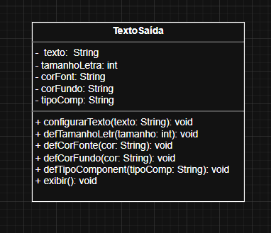
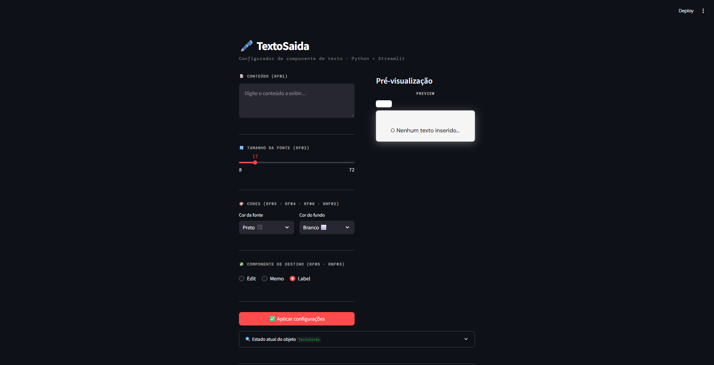

# 🖋️ TEXTOSAIDA – Configurador de Componente de Texto

> Projeto de Engenharia de Software · Python + Streamlit

---

## 📐 1. Diagrama de Classes

O diagrama abaixo foi elaborado em UML e descreve a estrutura do sistema com a classe **TextoSaida**, que encapsula texto, estilo tipográfico e componente de destino sem herança de frameworks visuais.



| Elemento | Tipo | Descrição |
|---|---|---|
| `TextoSaida` | Classe | Entidade central que gerencia texto, estilo e tipo de componente (RNF01) |
| `texto` | String (privado) | RF01 – Conteúdo textual a ser exibido |
| `tamanhoLetra` | int (privado) | RF02 – Tamanho da fonte em pixels (8–72 px) |
| `corFont` | String (privado) | RF03 / RF06 – Cor da fonte, restrita à paleta de 5 cores (RNF02) |
| `corFundo` | String (privado) | RF04 / RF06 – Cor do fundo, restrita à paleta de 5 cores (RNF02) |
| `tipoComp` | String (privado) | RF05 – Componente de destino: `label`, `edit` ou `memo` (RNF03) |
| `configurarTexto()` | Método público | RF01 – Define o conteúdo do texto de saída |
| `defTamanhoLetr()` | Método público | RF02 – Define o tamanho da fonte, com clamp entre 8 e 72 px |
| `defCorFonte()` | Método público | RF03 / RF06 – Define a cor da fonte com validação de paleta |
| `defCorFundo()` | Método público | RF04 / RF06 – Define a cor do fundo com validação de paleta |
| `defTipoComponent()` | Método público | RF05 – Define o componente de destino com validação de tipo |
| `exibir()` | Método público | Retorna dicionário com todos os atributos para renderização visual |

---

## ✅ 2. Requisitos Funcionais (RF)

| ID | Descrição |
|---|---|
| RF01 | Permitir a inserção de um conteúdo de texto a ser exibido. |
| RF02 | Permitir a configuração do tamanho da fonte (8–72 px). |
| RF03 | Permitir a escolha da cor da fonte entre cinco opções: preto, branco, azul, amarelo e cinza. |
| RF04 | Permitir a escolha da cor de fundo entre cinco opções: preto, branco, azul, amarelo e cinza. |
| RF05 | Permitir ao usuário selecionar o componente de destino: Label, Edit ou Memo. |
| RF06 | Validar se as cores de fonte e de fundo escolhidas estão dentro da paleta permitida. |

---

## 🔒 3. Requisitos Não Funcionais (RNF)

| ID | Descrição |
|---|---|
| RNF01 | **Independência de plataforma** — a classe `TextoSaida` não herda de classes visuais de nenhum framework; mantém foco conceitual puro. |
| RNF02 | **Restrição de domínio** — as cores são estritamente limitadas ao conjunto: preto, branco, azul, amarelo e cinza; qualquer valor fora desse conjunto gera `ValueError`. |
| RNF03 | **Usabilidade** — os tipos de componente permitidos são exclusivamente `label`, `edit` e `memo`; tipos inválidos são rejeitados com mensagem de erro. |
| RNF04 | **Extensibilidade** — novos tipos de componentes podem ser adicionados ao conjunto `COMPONENTES_PERMITIDOS` sem alterar a lógica dos atributos da classe. |

---

## 🧠 4. Engenharia de Prompt

### Prompt utilizado

```
Baseado nos requisitos funcionais e não funcionais e no diagrama de classes em anexo,
construa uma aplicação com Python e Streamlit em um único arquivo com funcionalidades
necessárias e aplicações para funcionar agora mesmo.
```

### Análise das técnicas aplicadas

| Técnica | Como foi aplicada |
|---|---|
| **Contexto rico** | Diagrama UML + RFs + NRFs fornecidos como contexto estruturado junto ao prompt |
| **Restrição de stack** | `"Python e Streamlit em um único arquivo"` – delimita tecnologias e formato de entrega |
| **Orientação ao resultado** | `"funcionar agora mesmo"` – evita saídas parciais ou apenas explicativas |
| **Completude implícita** | `"funcionalidades necessárias"` – o modelo infere o que não foi listado explicitamente |
| **Multimodal** | Imagem do diagrama de classes enviada junto ao prompt textual |

---

## 🖥️ 5. Projeto em Execução

Captura da aplicação rodando: painel de configuração à esquerda com controles de texto, tamanho, cores e tipo de componente — à direita, pré-visualização em tempo real do componente simulado com badge de tipo e espelho do estado do objeto.



---

## 🚀 6. Como Fazer o Projeto Rodar

### Pré-requisito

- **Python 3.8+** → Baixe em [https://www.python.org/downloads/](https://www.python.org/downloads/)

---

### Passo 1 – Salve o arquivo

Salve o arquivo `app.py` em uma pasta de sua preferência:

```
# Windows
C:\Projetos\textosaida\app.py

# Mac / Linux
~/projetos/textosaida/app.py
```

---

### Passo 2 – Instale o Streamlit

Abra o terminal (Prompt de Comando no Windows / Terminal no Mac-Linux) e execute:

```bash
pip install streamlit
```

---

### Passo 3 – Execute a aplicação

No terminal, navegue até a pasta do arquivo e execute:

```bash
# Windows
cd C:\Projetos\textosaida

# Mac / Linux
cd ~/projetos/textosaida

# Rodar
streamlit run app.py
```

---

### Passo 4 – Acesse no navegador

O Streamlit abrirá o navegador automaticamente. Se não abrir, acesse manualmente:

```
http://localhost:8501
```

---

### Passo 5 – Use a aplicação

| Clique | O que fazer |
|---|---|
| **1º clique** | Digite o texto na área de conteúdo (RF01) — o preview atualiza em tempo real |
| **2º clique** | Ajuste o tamanho da fonte com o slider (RF02) |
| **3º clique** | Escolha a cor da fonte e a cor do fundo nos seletores (RF03 / RF04) |
| **4º clique** | Selecione o componente de destino: Label, Edit ou Memo (RF05) |
| **✅ *(confirmar)*** | Clique em **Aplicar configurações** para validar e aplicar as alterações (RF06) |
| **🔍 *(extra)*** | Expanda **Estado atual do objeto** para inspecionar os atributos da instância `TextoSaida` |

---

*Projeto gerado com Engenharia de Prompt · Python 3 · Streamlit · 2026*