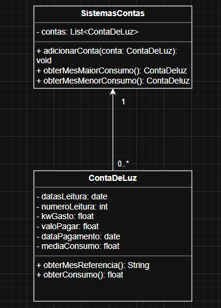
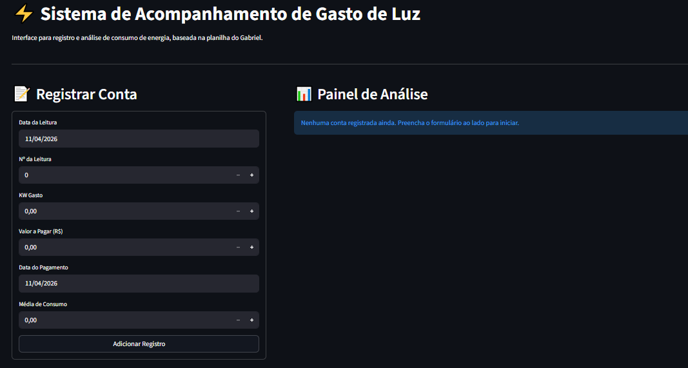

# 💡 PROJETO – Gestão de Conta de Luz

> Projeto de Engenharia de Software · Python + Streamlit

---

## 📐 1. Diagrama de Classes

O diagrama abaixo descreve a estrutura do sistema, utilizando uma classe controladora SistemasContas para gerenciar uma lista de objetos da classe ContaDeLuz.



---

## ✅ 2. Requisitos Funcionais (RF)

- RF01: Registrar Conta de Luz 
- RF02: Identificar Menor Consumo 
- RF03: Identificar Maior Consumo 
- RF04: Armazenar Histórico 
- RF05: Realizar media dos consumos
---

## 🔒 3. Requisitos Não Funcionais (NRF)

- RNF01: O sistema deve ter uma interface simples e intuitiva
- RNF02: Os valores de "Maior" e "Menor" consumo devem ser destacados visualmente
- RNF03: O sistema deve garantir que os cálculos de média e consumo sejam precisos
- RNF04: O sistema não deve permitir a entrada de valores negativos para o "KW gasto" ou "Valor a pagar"

---

## 🧠 4. Engenharia de Prompt

### Prompt utilizado

```
Baseado nos requisitos funcionais e não funcionais e no diagrama de classes em anexo,
construa uma aplicação com Python e Streamlit em um único arquivo com funcionalidades
necessárias e aplicações para funcionar agora mesmo.
```

### Análise das técnicas aplicadas

| Técnica | Como foi aplicada |
|---|---|
| **Contexto rico** | Diagrama UML + RFs + NRFs fornecidos como contexto estruturado junto ao prompt |
| **Restrição de stack** | `"Python e Streamlit em um único arquivo"` – delimita tecnologias e formato de entrega |
| **Orientação ao resultado** | `"funcionar agora mesmo"` – evita saídas parciais ou apenas explicativas |
| **Completude implícita** | `"funcionalidades necessárias"` – o modelo infere o que não foi listado explicitamente |
| **Multimodal** | Imagem do diagrama de classes enviada junto ao prompt textual |

---

## 🖥️ 5. Projeto em Execução

A aplicação em execução apresenta uma interface web responsiva onde o usuário cadastra suas faturas de luz através de um formulário lateral. Ao enviar os dados, o sistema valida as informações, bloqueando valores negativos, e armazena o registro na memória temporária da sessão. Imediatamente, o painel principal é atualizado exibindo todo o histórico de contas cadastradas em uma tabela interativa gerada com Pandas. Simultaneamente, cards visuais coloridos destacam em tempo real os cálculos de maior consumo, menor consumo e a média geral de gastos.



---

## 🚀 6. Como Fazer o Projeto Rodar

### Pré-requisito

- **Python 3.8+** → Baixe em [https://www.python.org/downloads/](https://www.python.org/downloads/)

---

### Passo 1 – Salve o arquivo

Salve o arquivo `app.py` em uma pasta de sua preferência:

```
# Windows
C:\Projetos\boneco\app.py

# Mac / Linux
~/projetos/boneco/app.py
```

---

### Passo 2 – Instale o Streamlit

Abra o terminal (Prompt de Comando no Windows / Terminal no Mac-Linux) e execute:

```bash
pip install streamlit pandas
```

---

### Passo 3 – Execute a aplicação

No terminal, navegue até a pasta do arquivo e execute:

```bash
# Windows
cd C:\Projetos\boneco

# Mac / Linux
cd ~/projetos/boneco

# Rodar
streamlit run boneco_app.py
```

---

### Passo 4 – Acesse no navegador

O Streamlit abrirá o navegador automaticamente. Se não abrir, acesse manualmente:

```
http://localhost:8501
```

---

### Passo 5 – Use a aplicação

| Passo | O que fazer |
|---|---|
| **1º passo** | Preencha os dados da fatura (Data, KW Gasto, Valor, etc.) no formulário lateral |
| **2º passo** | Clique no botão **Adicionar Registro** para salvar a conta no sistema |
| 📊 *(extra)* | Acompanhe os painéis coloridos para ver o **Maior Consumo**, **Menor Consumo** e **Média** |
| 📋 *(extra)* | Role a página para visualizar todo o seu histórico atualizado na tabela interativa |
---

*Projeto gerado com Engenharia de Prompt · Python 3 · Streamlit · 2026*