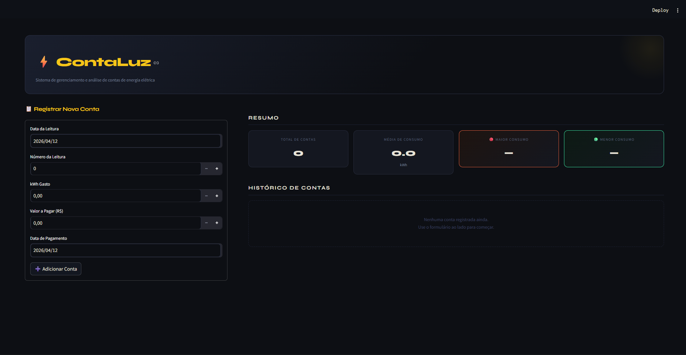

# ⚡ CONTALUZ – Sistema de Contas de Energia Elétrica

> Projeto de Engenharia de Software · Python + Streamlit

---

## 📐 1. Diagrama de Classes

O diagrama abaixo foi elaborado em UML e descreve a estrutura do sistema com as classes **ContaDeLuz** e **SistemasContas**, com relação de composição entre elas.


| Elemento | Tipo | Descrição |
|---|---|---|
| `ContaDeLuz` | Classe | RF01 – Representa uma conta mensal de energia elétrica |
| `SistemasContas` | Classe | RF02 / RF03 / RF04 / RF05 – Agrega contas e realiza análises de consumo |
| `data_leitura` | Date (privado) | RF01 – Data em que foi realizada a leitura do medidor |
| `numero_leitura` | int (privado) | RF01 – Número identificador da leitura |
| `kw_gasto` | float (privado) | RF01 / RF05 – Consumo em kWh do período (≥ 0 — RNF04) |
| `valor_pagar` | float (privado) | RF01 – Valor em R$ a ser pago na conta (≥ 0 — RNF04) |
| `data_pagamento` | Date (privado) | RF01 – Data de vencimento/pagamento da conta |
| `media_consumo` | float | RF05 – Média geral de consumo, recalculada a cada inserção |
| `contas` | List[ContaDeLuz] | RF04 – Histórico completo de contas registradas |
| `obter_mes_referencia()` | Método público | RF01 – Retorna o mês/ano de referência da conta |
| `obter_consumo()` | Método público | RF05 – Retorna o kWh gasto na conta |
| `adicionar_conta()` | Método público | RF01 / RF04 – Registra nova conta e recalcula médias |
| `obter_mes_maior_consumo()` | Método público | RF03 – Retorna a conta com maior kWh registrado |
| `obter_mes_menor_consumo()` | Método público | RF02 – Retorna a conta com menor kWh registrado |
| `media_geral()` | Método público | RF05 – Calcula a média de consumo de todas as contas |
| `to_dataframe()` | Método público | RF04 – Converte o histórico em tabela para exibição e exportação |

---

## ✅ 2. Requisitos Funcionais (RF)

| ID | Descrição |
|---|---|
| RF01 | Registrar conta de luz com data de leitura, número da leitura, kWh gasto, valor a pagar e data de pagamento. |
| RF02 | Identificar e destacar o mês de menor consumo de energia. |
| RF03 | Identificar e destacar o mês de maior consumo de energia. |
| RF04 | Armazenar e exibir o histórico completo de contas com exportação em CSV. |
| RF05 | Calcular e exibir a média geral de consumo (kWh), atualizada a cada novo registro. |

---

## 🔒 3. Requisitos Não Funcionais (RNF)

| ID | Descrição |
|---|---|
| RNF01 | Interface simples e intuitiva com layout em duas colunas: formulário à esquerda e painel de análise à direita. |
| RNF02 | Os valores de maior consumo são destacados em vermelho e os de menor consumo em verde, tanto nos cards de métricas quanto nas linhas da tabela histórica. |
| RNF03 | Os cálculos de média e consumo devem ser precisos, recalculados automaticamente a cada inserção sem intervenção manual. |
| RNF04 | O sistema não permite a entrada de valores negativos para kWh gasto ou valor a pagar — validação aplicada antes do registro. |

---

## 🧠 4. Engenharia de Prompt

### Prompt utilizado

```
Baseado nos requisitos funcionais e não funcionais e no diagrama de classes em anexo,
construa uma aplicação com Python e Streamlit em um único arquivo com funcionalidades
necessárias e aplicações para funcionar agora mesmo.
```

### Análise das técnicas aplicadas

| Técnica | Como foi aplicada |
|---|---|
| **Contexto rico** | Diagrama UML + RFs + NRFs fornecidos como contexto estruturado junto ao prompt |
| **Restrição de stack** | `"Python e Streamlit em um único arquivo"` – delimita tecnologias e formato de entrega |
| **Orientação ao resultado** | `"funcionar agora mesmo"` – evita saídas parciais ou apenas explicativas |
| **Completude implícita** | `"funcionalidades necessárias"` – o modelo infere o que não foi listado explicitamente |
| **Multimodal** | Imagem do diagrama de classes enviada junto ao prompt textual |

---

## 🖥️ 5. Projeto em Execução

Captura da aplicação rodando: painel principal exibindo os cards de resumo com maior e menor consumo destacados, tabela histórica com linhas coloridas e gráfico de evolução do consumo em kWh — tema escuro com destaques em amarelo.



---

## 🚀 6. Como Fazer o Projeto Rodar

### Pré-requisito

- **Python 3.8+** → Baixe em [https://www.python.org/downloads/](https://www.python.org/downloads/)

---

### Passo 1 – Salve o arquivo

Salve o arquivo `app.py` em uma pasta de sua preferência:

```
# Windows
C:\Projetos\contaluz\app.py

# Mac / Linux
~/projetos/contaluz/app.py
```

---

### Passo 2 – Instale as dependências

Abra o terminal (Prompt de Comando no Windows / Terminal no Mac-Linux) e execute:

```bash
pip install streamlit pandas
```

---

### Passo 3 – Execute a aplicação

No terminal, navegue até a pasta do arquivo e execute:

```bash
# Windows
cd C:\Projetos\contaluz

# Mac / Linux
cd ~/projetos/contaluz

# Rodar
streamlit run app.py
```

---

### Passo 4 – Acesse no navegador

O Streamlit abrirá o navegador automaticamente. Se não abrir, acesse manualmente:

```
http://localhost:8501
```

---

### Passo 5 – Use a aplicação

| Clique | O que fazer |
|---|---|
| **1º clique** | Preencha o formulário à esquerda com os dados da conta (data, leitura, kWh, valor e vencimento) |
| **2º clique** | Clique em **➕ Adicionar Conta** para registrar — os cards e a tabela atualizam automaticamente |
| **📊 *(automático)*** | O gráfico de evolução do consumo é gerado assim que há pelo menos uma conta registrada |
| **⬇️ *(extra)*** | Clique em **Exportar CSV** para baixar o histórico completo em formato CSV |

---

*Projeto gerado com Engenharia de Prompt · Python 3 · Streamlit · 2026*