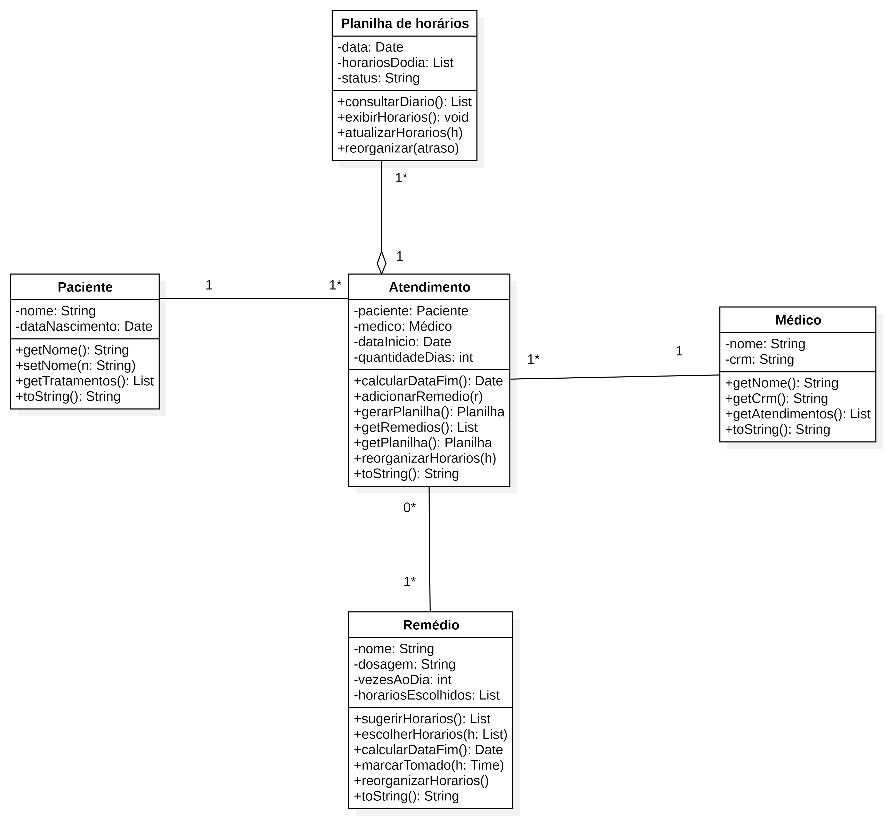
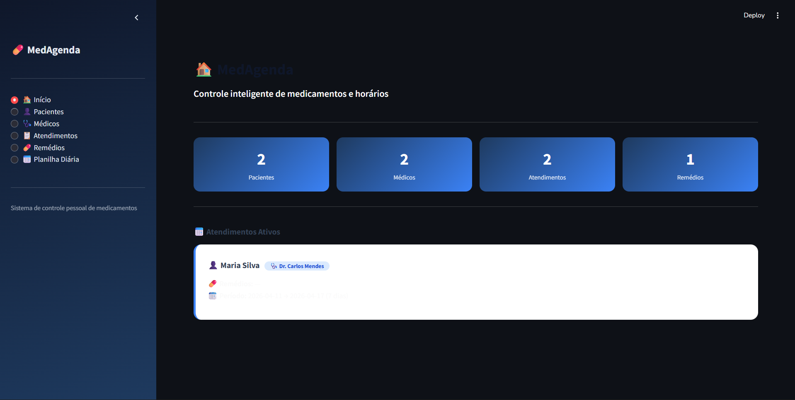

# 💊 MEDAGENDA – Controle de Medicamentos

> Projeto de Engenharia de Software · Python + Streamlit

---

## 📐 1. Diagrama de Classes

O diagrama abaixo foi elaborado em UML e descreve a estrutura do sistema com as classes **Paciente**, **Medico**, **Atendimento** e **Remedio**, além da enumeração **StatusPlanilha**.



| Elemento | Tipo | Descrição |
|---|---|---|
| `Paciente` | Classe | RF01 – Cadastro de paciente com nome e data de nascimento |
| `Medico` | Classe | RF02 – Cadastro de médico com nome e CRM |
| `Atendimento` | Classe | RF03 / RF04 – Vincula paciente, médico, período e remédios |
| `Remedio` | Classe | RF05 / RF06 / RF07 – Nome, dosagem, frequência e horários |
| `«enum» StatusPlanilha` | Enumeração | ATIVA · ENCERRADA |
| `nome` | String (privado) | Nome do paciente ou médico |
| `dataNascimento` | Date (privado) | RF01 – Data de nascimento do paciente |
| `crm` | String (privado) | RF02 – Registro do médico |
| `dataInicio` | Date (privado) | RF03 – Início do atendimento |
| `quantidadeDias` | int (privado) | RF04 – Duração do tratamento |
| `vezesAoDia` | int (privado) | RF06 – Frequência diária do remédio |
| `horariosEscolhidos` | List[str] (privado) | RF07 – Horários definidos pelo paciente |
| `tomados` | dict (privado) | RF08 – Registro de doses confirmadas |
| `sugerirHorarios()` | Método público | RF07 – Distribui horários automaticamente no intervalo 07h–22h |
| `gerarPlanilha()` | Método público | RF09 – Gera grade diária de todos os remédios e horários |
| `reorganizarHorarios()` | Método público | RF10 – Redistribui horários pendentes após atraso informado |
| `marcarTomado()` | Método público | RF08 – Confirma ou desfaz uma dose |

---

## ✅ 2. Requisitos Funcionais (RF)

| ID | Descrição |
|---|---|
| RF01 | Cadastrar paciente com nome e data de nascimento. |
| RF02 | Cadastrar médico com nome e CRM. |
| RF03 | Criar atendimento vinculando paciente, médico e data de início. |
| RF04 | Definir a quantidade de dias do tratamento. |
| RF05 | Cadastrar remédio com nome e dosagem dentro de um atendimento. |
| RF06 | Informar a frequência diária (vezes ao dia) de cada remédio. |
| RF07 | Sugerir horários automaticamente e permitir ajuste manual. |
| RF08 | Registrar e desfazer a confirmação de doses tomadas. |
| RF09 | Gerar planilha diária com todos os remédios e horários ordenados. |
| RF10 | Reorganizar horários pendentes do dia com base em atraso informado. |
| RF11 | Exibir progresso diário de adesão (doses tomadas / total). |
| RF12 | Exibir visão geral de adesão para todos os dias do tratamento. |

---

## 🔒 3. Requisitos Não Funcionais (NRF)

| ID | Descrição |
|---|---|
| NRF01 | Tempo de resposta máximo de 0,5 s por interação. |
| NRF02 | Persistência dos dados em arquivo JSON local entre sessões. |
| NRF03 | Consistência garantida entre remédios, horários e planilha gerada. |
| NRF04 | Interface navegável por menu lateral com no máximo 2 cliques por ação. |
| NRF05 | Horários de sugestão restritos ao intervalo 07h00 – 22h00. |
| NRF06 | Planilha regenerada automaticamente ao adicionar ou remover remédio. |

---

## 🧠 4. Engenharia de Prompt

### Prompt utilizado

```
Baseado nos requisitos funcionais e não funcionais e no diagrama de classes em anexo,
construa uma aplicação com Python e Streamlit em um único arquivo com funcionalidades
necessárias e aplicações para funcionar agora mesmo.
```

### Análise das técnicas aplicadas

| Técnica | Como foi aplicada |
|---|---|
| **Contexto rico** | Diagrama UML + RFs + NRFs fornecidos como contexto estruturado junto ao prompt |
| **Restrição de stack** | `"Python e Streamlit em um único arquivo"` – delimita tecnologias e formato de entrega |
| **Orientação ao resultado** | `"funcionar agora mesmo"` – evita saídas parciais ou apenas explicativas |
| **Completude implícita** | `"funcionalidades necessárias"` – o modelo infere o que não foi listado explicitamente |
| **Multimodal** | Imagem do diagrama de classes enviada junto ao prompt textual |

---

## 🖥️ 5. Projeto em Execução

Captura da aplicação rodando: tela **Planilha Diária** exibindo os horários de medicamentos do paciente, com progresso de doses e opção de reorganização por atraso.



---

## 🚀 6. Como Fazer o Projeto Rodar

### Pré-requisito

- **Python 3.8+** → Baixe em [https://www.python.org/downloads/](https://www.python.org/downloads/)

---

### Passo 1 – Salve os arquivos

Salve `app.py` e `medicamentos_data.json` na mesma pasta:

```
# Windows
C:\Projetos\medagenda\app.py
C:\Projetos\medagenda\medicamentos_data.json

# Mac / Linux
~/projetos/medagenda/app.py
~/projetos/medagenda/medicamentos_data.json
```

---

### Passo 2 – Instale o Streamlit

Abra o terminal (Prompt de Comando no Windows / Terminal no Mac-Linux) e execute:

```bash
pip install streamlit
```

---

### Passo 3 – Execute a aplicação

No terminal, navegue até a pasta do arquivo e execute:

```bash
# Windows
cd C:\Projetos\medagenda

# Mac / Linux
cd ~/projetos/medagenda

# Rodar
streamlit run app.py
```

---

### Passo 4 – Acesse no navegador

O Streamlit abrirá o navegador automaticamente. Se não abrir, acesse manualmente:

```
http://localhost:8501
```

---

### Passo 5 – Use a aplicação

| Clique | O que fazer |
|---|---|
| **1º clique** | Acesse **👤 Pacientes** ou **🩺 Médicos** para cadastrar os envolvidos |
| **2º clique** | Acesse **📋 Atendimentos** para criar um atendimento e definir o período |
| **3º clique** | Acesse **💊 Remédios** para cadastrar os medicamentos e confirmar horários |
| **4º clique** | Em **📋 Atendimentos**, clique em **📅 Gerar Planilha** para ativar o controle diário |
| **✅ *(diário)*** | Em **📅 Planilha Diária**, marque as doses à medida que forem tomadas |
| **⏰ *(extra)*** | Use **Reorganizar por atraso** para redistribuir os horários pendentes do dia |

---

*Projeto gerado com Engenharia de Prompt · Python 3 · Streamlit · 2026*