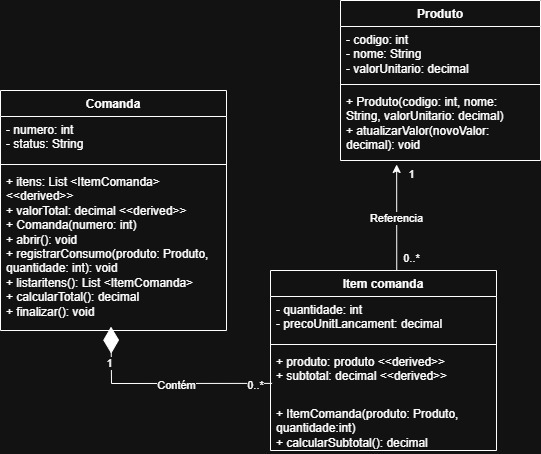
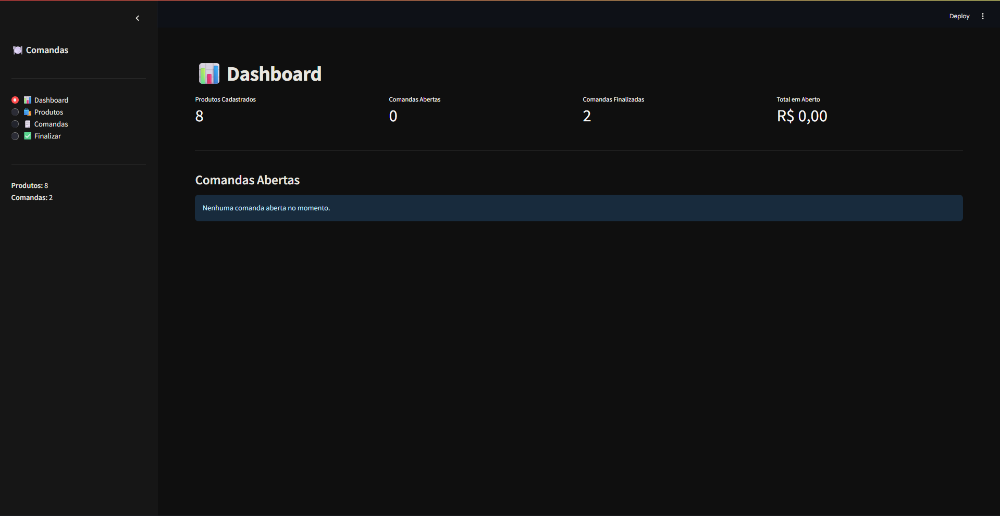

# 🍽️ SISTEMA DE COMANDAS – Controle de Consumo

> Projeto de Engenharia de Software · Python + Streamlit

---

## 📐 1. Diagrama de Classes

O diagrama abaixo foi elaborado em UML e descreve a estrutura do sistema com as classes **Produto**, **ItemComanda** e **Comanda**, relacionadas por composição e associação.



| Elemento | Tipo | Descrição |
|---|---|---|
| `Produto` | Classe | RF01 / RF02 – Produto com código, nome e valor unitário |
| `ItemComanda` | Classe | RF05 – Item lançado em uma comanda com snapshot de preço |
| `Comanda` | Classe | RF03 / RF04 / RF06 / RF07 – Entidade central do sistema |
| `codigo` | int (privado) | RF01 – Identificador único do produto gerado em sequência |
| `nome` | String (privado) | RF01 – Nome do produto |
| `valor_unitario` | float (privado) | RF01 / RF02 – Preço do produto em R$ |
| `numero` | int (privado) | RF03 – Número sequencial da comanda (NRF03) |
| `status` | String (privado) | RF06 / RF07 – Estado da comanda: `"aberta"` ou `"finalizada"` |
| `_itens` | List[ItemComanda] (privado) | RF05 – Lista de itens consumidos |
| `quantidade` | int (privado) | RF05 – Quantidade do produto no item |
| `preco_unit_lancamento` | float (privado) | RF05 – Snapshot do preço no momento do lançamento |
| `subtotal` | float (propriedade) | RF05 – Valor calculado: quantidade × preço de lançamento |
| `valor_total` | float (propriedade) | RF06 – Soma dos subtotais de todos os itens |
| `atualizar_valor()` | Método público | RF02 – Atualiza o valor unitário do produto |
| `abrir()` | Método público | RF03 – Define o status como `"aberta"` |
| `registrar_consumo()` | Método público | RF05 / RF07 – Lança produto na comanda ou lança erro se finalizada |
| `listar_itens()` | Método público | RF06 – Retorna os itens da comanda |
| `calcular_total()` | Método público | RF06 – Retorna o valor total da comanda |
| `finalizar()` | Método público | RF07 – Encerra a comanda bloqueando novos lançamentos |

---

## ✅ 2. Requisitos Funcionais (RF)

| ID | Descrição |
|---|---|
| RF01 | Cadastrar produto com nome e valor unitário. |
| RF02 | Atualizar o valor unitário de um produto existente. |
| RF03 | Abrir uma nova comanda com número gerado automaticamente em sequência crescente. |
| RF04 | Listar todas as comandas com seus respectivos status e totais. |
| RF05 | Registrar consumo de produto em uma comanda aberta, informando quantidade. |
| RF06 | Calcular e exibir o total da comanda com subtotais por item. |
| RF07 | Finalizar a comanda, bloqueando novos lançamentos após o fechamento. |
| RF08 | Exibir dashboard com totais de produtos, comandas abertas, finalizadas e valor em aberto. |

---

## 🔒 3. Requisitos Não Funcionais (NRF)

| ID | Descrição |
|---|---|
| NRF01 | Tempo de resposta máximo de 0,5 s por interação. |
| NRF02 | Valor unitário deve ser obrigatoriamente maior que zero — validado no domínio e na interface. |
| NRF03 | Numeração das comandas gerada em ordem crescente e sem lacunas. |
| NRF04 | Preço snapshot — o valor lançado no item é o preço do momento, imune a atualizações posteriores. |
| NRF05 | Persistência em memória de sessão (st.session_state) com dados iniciais de exemplo. |
| NRF06 | Interface escura (dark mode) com navegação lateral em no máximo 2 cliques por ação. |

---

## 🧠 4. Engenharia de Prompt

### Prompt utilizado

```
Construa uma aplicação funcional em Python utilizando Streamlit, em um único arquivo executável, com base nos requisitos funcionais, não funcionais e no diagrama de classes fornecidos em anexo.
A aplicação deve obrigatoriamente:

1 - Implementar todas as entidades, atributos e relacionamentos definidos no diagrama de classes, respeitando composição, agregação e herança quando aplicável

2 - Traduzir os requisitos funcionais em funcionalidades reais na interface (CRUD completo, autenticação, filtros, etc., conforme especificado)

3 - Atender aos requisitos não funcionais, incluindo:

• organização de código
• separação lógica (mesmo em arquivo único)
• legibilidade e manutenção

4 - Utilizar Streamlit para construir uma interface interativa com:

• navegação entre páginas ou seções
• formulários funcionais
• exibição de dados dinâmica

5 - Implementar persistência de dados (pode ser em memória, JSON ou SQLite, mas deve funcionar imediatamente sem configuração adicional)

6 - Incluir dados iniciais mockados para permitir teste imediato

7 - Estar pronto para execução com o comando: streamlit run app.py

8 - Restrições obrigatórias:

• Código deve estar em um único arquivo
• Não utilizar dependências externas além de Streamlit e bibliotecas padrão do Python
• Não deixar funcionalidades incompletas ou simuladas
• Não explicar conceitos, apenas implementar

9 - Critérios de aceitação:

• A aplicação roda sem erro ao executar
• Todas as funcionalidades principais estão operacionais
• Interface permite fluxo completo de uso sem intervenção manual no código

10 - Saída esperada:

• Código completo do arquivo app.py
```

### Análise das técnicas aplicadas

| Técnica | Como foi aplicada |
|---|---|
| **Contexto rico** | Diagrama UML + RFs + NRFs fornecidos como contexto estruturado junto ao prompt |
| **Restrição de stack** | `"Python e Streamlit em um único arquivo"` – delimita tecnologias e formato de entrega |
| **Orientação ao resultado** | `"funcionar agora mesmo"` – evita saídas parciais ou apenas explicativas |
| **Completude implícita** | `"funcionalidades necessárias"` – o modelo infere o que não foi listado explicitamente |
| **Multimodal** | Imagem do diagrama de classes enviada junto ao prompt textual |

---

## 🖥️ 5. Projeto em Execução

Captura da aplicação rodando: tela **Comandas** exibindo o registro de consumo com seleção de comanda aberta, produto e quantidade — tema escuro com destaques em dourado e tipografia industrial.



---

## 🚀 6. Como Fazer o Projeto Rodar

### Pré-requisito

- **Python 3.8+** → Baixe em [https://www.python.org/downloads/](https://www.python.org/downloads/)

---

### Passo 1 – Salve o arquivo

Salve o arquivo `app.py` em uma pasta de sua preferência:

```
# Windows
C:\Projetos\comandas\app.py

# Mac / Linux
~/projetos/comandas/app.py
```

---

### Passo 2 – Instale o Streamlit

Abra o terminal (Prompt de Comando no Windows / Terminal no Mac-Linux) e execute:

```bash
pip install streamlit
```

---

### Passo 3 – Execute a aplicação

No terminal, navegue até a pasta do arquivo e execute:

```bash
# Windows
cd C:\Projetos\comandas

# Mac / Linux
cd ~/projetos/comandas

# Rodar
streamlit run app.py
```

---

### Passo 4 – Acesse no navegador

O Streamlit abrirá o navegador automaticamente. Se não abrir, acesse manualmente:

```
http://localhost:8501
```

---

### Passo 5 – Use a aplicação

| Clique | O que fazer |
|---|---|
| **📊 Dashboard** | Visualize os totais gerais e o resumo de todas as comandas abertas |
| **🛍️ Produtos** | Cadastre novos produtos ou atualize o valor unitário de um existente |
| **🗒️ Comandas** | Abra novas comandas, liste todas e registre o consumo de produtos |
| **✅ Finalizar** | Selecione uma comanda aberta, revise o resumo e confirme o fechamento |

---

*Projeto gerado com Engenharia de Prompt · Python 3 · Streamlit · 2026*