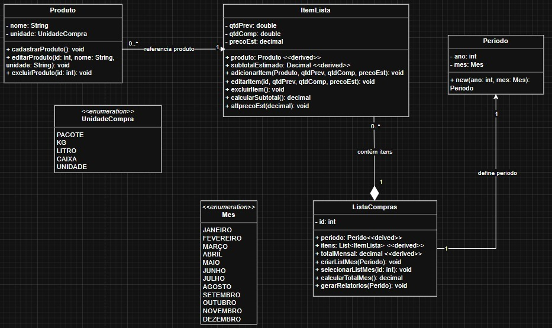
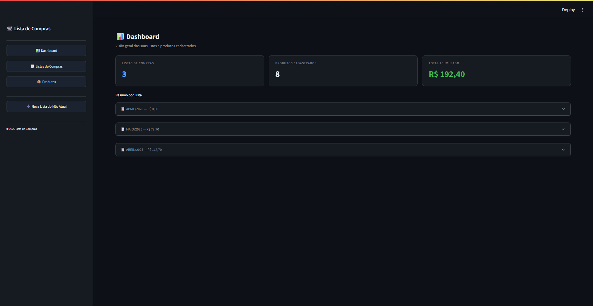

# 🛒 LISTA DE COMPRAS – Controle de Compras Mensais

> Projeto de Engenharia de Software · Python + Streamlit

---

## 📐 1. Diagrama de Classes

O diagrama abaixo foi elaborado em UML e descreve a estrutura do sistema com as enumerações **UnidadeCompra** e **Mes**, e as classes **Produto**, **Periodo**, **ItemLista** e **ListaCompras**, relacionadas por composição.



| Elemento | Tipo | Descrição |
|---|---|---|
| `«enum» UnidadeCompra` | Enumeração | PACOTE · KG · LITRO · CAIXA · UNIDADE |
| `«enum» Mes` | Enumeração | JANEIRO a DEZEMBRO — com conversão para número ordinal |
| `Produto` | Classe | RF01 – Produto do catálogo com nome e unidade de compra |
| `Periodo` | Classe | RF02 – Representa o mês/ano da lista de compras |
| `ItemLista` | Classe | RF01 / RF05 / RF07 – Item dentro de uma lista com quantidades e preço |
| `ListaCompras` | Classe | RF02 / RF06 – Agrupa os itens de um período e calcula o total |
| `id` | int (privado) | Identificador único do produto ou da lista, gerado em sequência |
| `nome` | String (privado) | RF01 – Nome do produto (obrigatório — RNF02) |
| `unidade` | UnidadeCompra (privado) | RF01 – Unidade de compra do produto |
| `ano` | int (privado) | RF02 – Ano da lista de compras |
| `mes` | Mes (privado) | RF02 – Mês da lista de compras |
| `produto_id` | int (privado) | RF01 – Referência ao produto cadastrado |
| `qtd_prev` | float (privado) | RF01 – Quantidade prevista para o mês |
| `qtd_comp` | float (privado) | RF01 – Quantidade efetivamente a ser comprada |
| `preco_est` | float (privado) | RF01 / RF07 – Preço estimado do item (≥ 0 — RNF02) |
| `subtotal_estimado` | float (propriedade) | RF05 – Calculado como `qtd_comp × preco_est` |
| `total_mensal` | float (propriedade) | RF06 – Soma de todos os subtotais da lista (RNF05) |
| `criar_lista_mes()` | Método estático | RF02 – Cria uma nova lista para um período informado |

---

## ✅ 2. Requisitos Funcionais (RF)

| ID | Descrição |
|---|---|
| RF01 | Cadastrar produtos com nome, unidade de compra, quantidade prevista, quantidade a ser comprada e preço estimado. |
| RF02 | Criar e selecionar uma lista de compras por período (ano/mês). |
| RF03 | Editar as informações de qualquer produto cadastrado no catálogo. |
| RF04 | Excluir qualquer produto cadastrado (desde que não esteja em uso em uma lista). |
| RF05 | Calcular o subtotal estimado por item da lista. |
| RF06 | Exibir o total estimado do mês, somando todos os subtotais da lista. |
| RF07 | Permitir que o preço estimado de qualquer item seja atualizado mensalmente. |

---

## 🔒 3. Requisitos Não Funcionais (RNF)

| ID | Descrição |
|---|---|
| RNF01 | Interface simples e responsiva com seções claras para catálogo, lista mensal e totais. |
| RNF02 | Validações: quantidades ≥ 0; preço ≥ 0; nomes obrigatórios e únicos no catálogo. |
| RNF03 | Interface deve permitir visualizar e editar a lista de forma rápida e intuitiva, com no máximo 2 cliques. |
| RNF04 | Total do mês calculado corretamente e exibido em destaque no topo da lista selecionada. |
| RNF05 | Total atualizado automaticamente sempre que qualquer valor da lista for alterado. |

---

## 🧠 4. Engenharia de Prompt

### Prompt utilizado

```
Construa uma aplicação funcional em Python utilizando Streamlit, em um único arquivo executável, com base nos requisitos funcionais, não funcionais e no diagrama de classes fornecidos em anexo.
A aplicação deve obrigatoriamente:

1 - Implementar todas as entidades, atributos e relacionamentos definidos no diagrama de classes, respeitando composição, agregação e herança quando aplicável

2 - Traduzir os requisitos funcionais em funcionalidades reais na interface (CRUD completo, autenticação, filtros, etc., conforme especificado)

3 - Atender aos requisitos não funcionais, incluindo:

• organização de código
• separação lógica (mesmo em arquivo único)
• legibilidade e manutenção

4 - Utilizar Streamlit para construir uma interface interativa com:

• navegação entre páginas ou seções
• formulários funcionais
• exibição de dados dinâmica

5 - Implementar persistência de dados (em JSON)

6 - Incluir dados iniciais mockados para permitir teste imediato

7 - Estar pronto para execução com o comando: streamlit run app.py

8 - Restrições obrigatórias:

• Código deve estar em um único arquivo
• Não utilizar dependências externas além de Streamlit e bibliotecas padrão do Python
• Não deixar funcionalidades incompletas ou simuladas
• Não explicar conceitos, apenas implementar

9 - Critérios de aceitação:

• A aplicação roda sem erro ao executar
• Todas as funcionalidades principais estão operacionais
• Interface permite fluxo completo de uso sem intervenção manual no código

10 - Saída esperada:

• Código completo do arquivo app.py
```

### Análise das técnicas aplicadas

| Técnica | Como foi aplicada |
|---|---|
| **Contexto rico** | Diagrama UML + RFs + NRFs fornecidos como contexto estruturado junto ao prompt |
| **Restrição de stack** | `"Python e Streamlit em um único arquivo"` – delimita tecnologias e formato de entrega |
| **Orientação ao resultado** | `"funcionar agora mesmo"` – evita saídas parciais ou apenas explicativas |
| **Completude implícita** | `"funcionalidades necessárias"` – o modelo infere o que não foi listado explicitamente |
| **Multimodal** | Imagem do diagrama de classes enviada junto ao prompt textual |

---

## 🖥️ 5. Projeto em Execução

Captura da aplicação rodando: tela **Listas de Compras** exibindo o total estimado do mês em destaque, a tabela de itens com subtotais e os formulários de adição, edição e remoção de produtos — tema escuro com destaques em azul.



---

## 🚀 6. Como Fazer o Projeto Rodar

### Pré-requisito

- **Python 3.8+** → Baixe em [https://www.python.org/downloads/](https://www.python.org/downloads/)

---

### Passo 1 – Salve os arquivos

Salve `app.py` e `lista_compras_data.json` na mesma pasta:

```
# Windows
C:\Projetos\listacompras\app.py
C:\Projetos\listacompras\lista_compras_data.json

# Mac / Linux
~/projetos/listacompras/app.py
~/projetos/listacompras/lista_compras_data.json
```

---

### Passo 2 – Instale o Streamlit

Abra o terminal (Prompt de Comando no Windows / Terminal no Mac-Linux) e execute:

```bash
pip install streamlit
```

---

### Passo 3 – Execute a aplicação

No terminal, navegue até a pasta do arquivo e execute:

```bash
# Windows
cd C:\Projetos\listacompras

# Mac / Linux
cd ~/projetos/listacompras

# Rodar
streamlit run app.py
```

---

### Passo 4 – Acesse no navegador

O Streamlit abrirá o navegador automaticamente. Se não abrir, acesse manualmente:

```
http://localhost:8501
```

---

### Passo 5 – Use a aplicação

| Clique | O que fazer |
|---|---|
| **📊 Dashboard** | Visualize o resumo geral de todas as listas e o total acumulado |
| **➕ Nova Lista do Mês Atual** | Crie com um clique a lista do mês corrente diretamente pela barra lateral |
| **📋 Listas de Compras** | Selecione um período, adicione produtos, edite ✏️ quantidades e preços ou remova 🗑️ itens |
| **📦 Produtos** | Cadastre novos produtos no catálogo ou edite e exclua os existentes |

---

*Projeto gerado com Engenharia de Prompt · Python 3 · Streamlit · 2026*