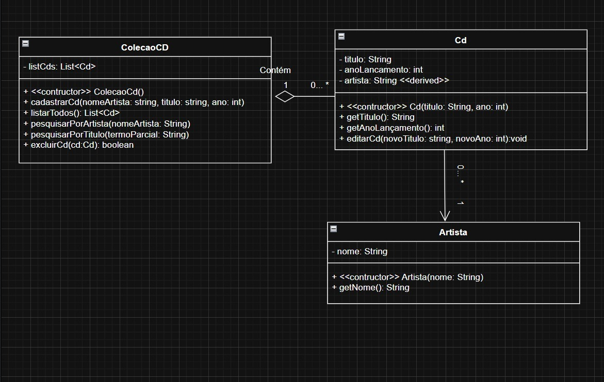
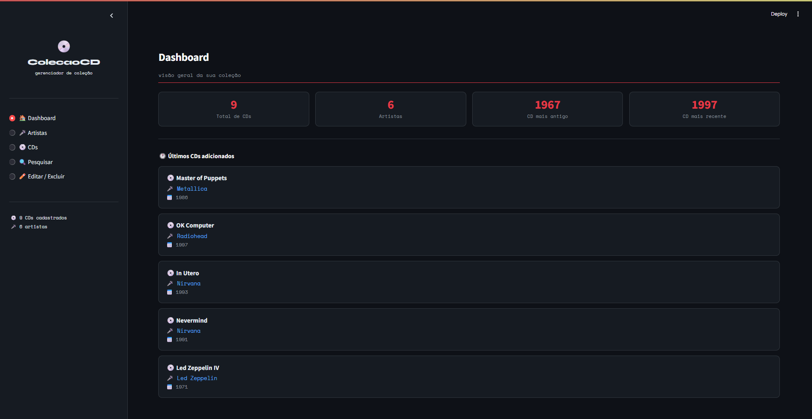

# 💿 COLECAOCD – Gerenciador de Coleção de CDs

> Projeto de Engenharia de Software · Python + Streamlit

---

## 📐 1. Diagrama de Classes

O diagrama abaixo foi elaborado em UML e descreve a estrutura do sistema com as classes **Artista**, **Cd** e **ColecaoCD**, com relação de composição entre `ColecaoCD` e `Cd`, e associação entre `Cd` e `Artista`.



| Elemento | Tipo | Descrição |
|---|---|---|
| `Artista` | Classe | RF01 – Representa um cantor(a) ou conjunto pelo nome |
| `Cd` | Classe | RF02 / RF06 / RF07 – Entidade principal com título, ano e referência ao artista |
| `ColecaoCD` | Classe | RF03 / RF04 / RF05 / RF08 – Gerencia a lista de CDs e aplica regras de negócio |
| `nome` | String (privado) | RF01 – Nome do artista ou conjunto (obrigatório — RNF02) |
| `_titulo` | String (privado) | RF02 – Título do CD (obrigatório — RNF02) |
| `_anoLancamento` | int (privado) | RF02 – Ano de lançamento do CD (1900–2100 — RNF02) |
| `_artista` | String (privado) | RF02 – Nome do artista associado ao CD |
| `_list_cds` | List[Cd] (privado) | RF03 – Lista interna de todos os CDs da coleção |
| `get_nome()` | Método público | RF01 – Retorna o nome do artista |
| `get_titulo()` | Método público | RF02 – Retorna o título do CD |
| `get_ano_lancamento()` | Método público | RF02 – Retorna o ano de lançamento do CD |
| `get_artista()` | Método público | RF02 – Retorna o nome do artista vinculado |
| `editar_cd()` | Método público | RF06 – Atualiza título, ano e artista de um CD existente |
| `cadastrar_cd()` | Método público | RF02 / RF08 – Valida duplicidade e adiciona CD à coleção |
| `listar_todos()` | Método público | RF03 – Retorna todos os CDs da coleção |
| `pesquisar_por_artista()` | Método público | RF04 – Filtra CDs pelo nome do artista (busca parcial) |
| `pesquisar_por_titulo()` | Método público | RF05 – Filtra CDs pelo título (busca parcial) |
| `excluir_cd()` | Método público | RF07 – Remove um CD da coleção |

---

## ✅ 2. Requisitos Funcionais (RF)

| ID | Descrição |
|---|---|
| RF01 | Cadastrar artista (cantor(a) ou conjunto) pelo nome. |
| RF02 | Cadastrar CD informando artista, título e ano de lançamento. |
| RF03 | Listar todos os CDs cadastrados com opções de ordenação por título, artista ou ano. |
| RF04 | Pesquisar CDs por nome de artista (busca parcial). |
| RF05 | Pesquisar CDs por título (busca parcial). |
| RF06 | Editar os dados de um CD existente (título, ano e artista). |
| RF07 | Excluir um CD com confirmação prévia. |
| RF08 | Evitar duplicidade óbvia — mesmo artista + mesmo título + mesmo ano rejeitados. |

---

## 🔒 3. Requisitos Não Funcionais (RNF)

| ID | Descrição |
|---|---|
| RNF01 | Interface simples e responsiva com seções claras para cadastro, listagem e busca. |
| RNF02 | Validações: ano no intervalo 1900–2100; título e nome de artista obrigatórios. |
| RNF03 | Consultas rápidas com filtro textual incremental — sem recarregamento de página. |
| RNF04 | Design system consistente: paleta de cores definida, tipografia padronizada (Syne + Space Mono) e espaçamentos uniformes. |
| RNF05 | Paleta de cores com boas práticas de UI/UX: vermelho para ação principal, azul para secundária, verde para sucesso, vermelho para erro, amarelo para alerta e contraste adequado para acessibilidade. |

---

## 🧠 4. Engenharia de Prompt

### Prompt utilizado

```
Construa uma aplicação funcional em Python utilizando Streamlit, em um único arquivo executável, com base nos requisitos funcionais, não funcionais e no diagrama de classes fornecidos em anexo.
A aplicação deve obrigatoriamente:

1 - Implementar todas as entidades, atributos e relacionamentos definidos no diagrama de classes, respeitando composição, agregação e herança quando aplicável

2 - Traduzir os requisitos funcionais em funcionalidades reais na interface (CRUD completo, autenticação, filtros, etc., conforme especificado)

3 - Atender aos requisitos não funcionais, incluindo:

• organização de código
• separação lógica (mesmo em arquivo único)
• legibilidade e manutenção

4 - Utilizar Streamlit para construir uma interface interativa com:

• navegação entre páginas ou seções
• formulários funcionais
• exibição de dados dinâmica

5 - Implementar persistência de dados (em JSON)

6 - Incluir dados iniciais mockados para permitir teste imediato

7 - Estar pronto para execução com o comando: streamlit run app.py

8 - Restrições obrigatórias:

• Código deve estar em um único arquivo
• Não utilizar dependências externas além de Streamlit e bibliotecas padrão do Python
• Não deixar funcionalidades incompletas ou simuladas
• Não explicar conceitos, apenas implementar

9 - Critérios de aceitação:

• A aplicação roda sem erro ao executar
• Todas as funcionalidades principais estão operacionais
• Interface permite fluxo completo de uso sem intervenção manual no código

10 - Saída esperada:

• Código completo do arquivo app.py
```

### Análise das técnicas aplicadas

| Técnica | Como foi aplicada |
|---|---|
| **Contexto rico** | Diagrama UML + RFs + NRFs fornecidos como contexto estruturado junto ao prompt |
| **Restrição de stack** | `"Python e Streamlit em um único arquivo"` – delimita tecnologias e formato de entrega |
| **Orientação ao resultado** | `"funcionar agora mesmo"` – evita saídas parciais ou apenas explicativas |
| **Completude implícita** | `"funcionalidades necessárias"` – o modelo infere o que não foi listado explicitamente |
| **Multimodal** | Imagem do diagrama de classes enviada junto ao prompt textual |

---

## 🖥️ 5. Projeto em Execução

Captura da aplicação rodando: tela **CDs** exibindo a coleção completa com filtro rápido e ordenação — tema escuro com design system em vermelho, azul e cinza, tipografia Space Mono e cards estilizados por CD.



---

## 🚀 6. Como Fazer o Projeto Rodar

### Pré-requisito

- **Python 3.8+** → Baixe em [https://www.python.org/downloads/](https://www.python.org/downloads/)

---

### Passo 1 – Salve os arquivos

Salve `app.py` e `colecao_data.json` na mesma pasta:

```
# Windows
C:\Projetos\colecaocd\app.py
C:\Projetos\colecaocd\colecao_data.json

# Mac / Linux
~/projetos/colecaocd/app.py
~/projetos/colecaocd/colecao_data.json
```

---

### Passo 2 – Instale o Streamlit

Abra o terminal (Prompt de Comando no Windows / Terminal no Mac-Linux) e execute:

```bash
pip install streamlit
```

---

### Passo 3 – Execute a aplicação

No terminal, navegue até a pasta do arquivo e execute:

```bash
# Windows
cd C:\Projetos\colecaocd

# Mac / Linux
cd ~/projetos/colecaocd

# Rodar
streamlit run app.py
```

---

### Passo 4 – Acesse no navegador

O Streamlit abrirá o navegador automaticamente. Se não abrir, acesse manualmente:

```
http://localhost:8501
```

---

### Passo 5 – Use a aplicação

| Clique | O que fazer |
|---|---|
| **🏠 Dashboard** | Visualize estatísticas gerais e os 5 CDs adicionados mais recentemente |
| **🎤 Artistas** | Cadastre novos artistas ou exclua 🗑️ os que não possuem CDs vinculados |
| **💿 CDs** | Cadastre CDs, filtre a lista por título ou artista e ordene por campo |
| **🔍 Pesquisar** | Busque CDs por artista ou por parte do título em abas separadas |
| **✏️ Editar / Excluir** | Localize um CD, edite seus dados ou confirme a exclusão permanente |

---

*Projeto gerado com Engenharia de Prompt · Python 3 · Streamlit · 2026*