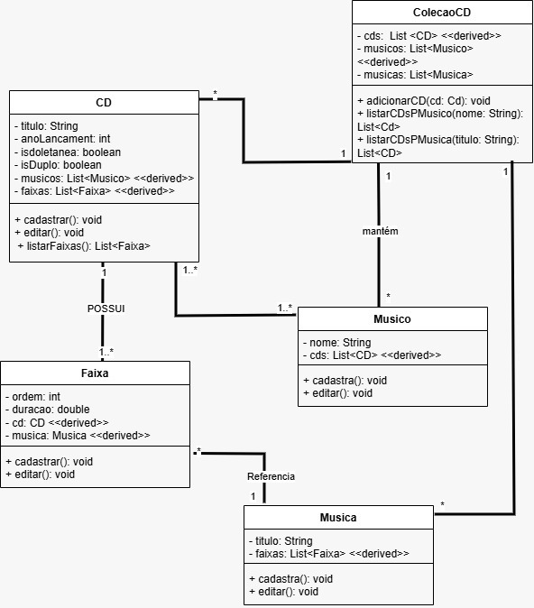
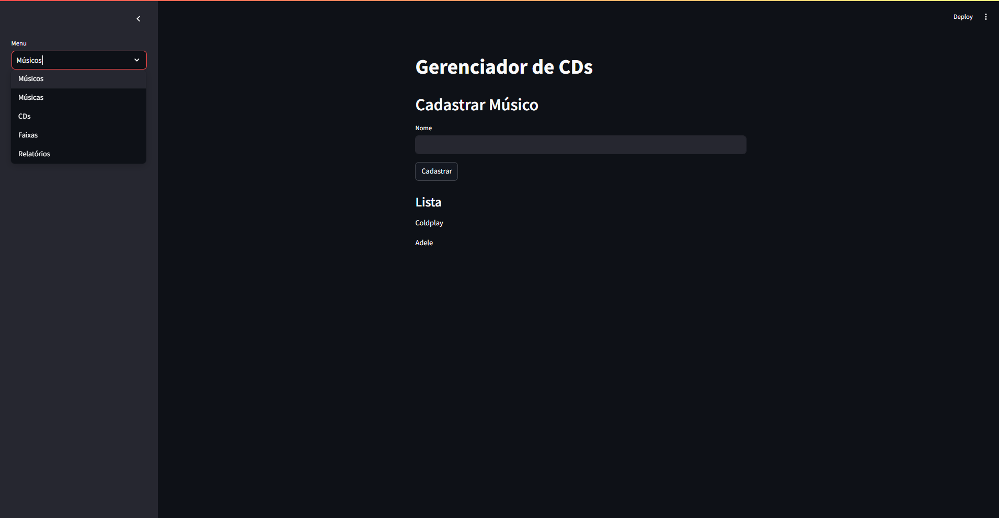

# 🎵 GERENCIADOR DE CDs – Coleção com Faixas e Músicos

> Projeto de Engenharia de Software · Python + Streamlit

---

## 📐 1. Diagrama de Classes

O diagrama abaixo foi elaborado em UML e descreve a estrutura do sistema com as classes **Musico**, **Musica**, **Faixa**, **CD** e **ColecaoCD**, relacionadas por composição e associação.



| Elemento | Tipo | Descrição |
|---|---|---|
| `Musico` | Classe | RF01 / RF03 – Músico ou banda vinculado(a) a um ou mais CDs |
| `Musica` | Classe | RF04 – Música cadastrada no sistema, reutilizável em faixas |
| `Faixa` | Classe | RF05 / RF06 – Faixa de um CD com ordem, duração e referência à música |
| `CD` | Classe | RF02 / RF03 – CD com título, ano, flags e listas de músicos e faixas |
| `ColecaoCD` | Classe | RF07 / RF08 – Agrega CDs, músicos e músicas; gerencia persistência |
| `nome` | String | RF01 – Nome do músico ou banda (obrigatório) |
| `titulo` | String | RF02 / RF04 – Título do CD ou da música (obrigatório) |
| `ano` | int | RF02 – Ano de lançamento do CD (1900–2100 — RNF02) |
| `coletanea` | bool | RF02 – Flag que indica se o CD é uma coletânea |
| `duplo` | bool | RF02 – Flag que indica se o CD é duplo |
| `musicos` | List[Musico] | RF03 – Lista de músicos associados ao CD |
| `faixas` | List[Faixa] | RF05 – Lista de faixas do CD |
| `ordem` | int | RF05 – Número de ordem da faixa no CD (≥ 1 — RNF02) |
| `duracao` | float | RF05 / RF06 – Duração da faixa em minutos (> 0 — RNF02) |
| `musica` | Musica | RF05 – Referência à música vinculada à faixa |
| `save()` | Método público | Persiste toda a coleção em arquivo JSON |
| `load()` | Método estático | Carrega a coleção do arquivo JSON ou inicializa com dados mock |
| `cds` | List[CD] | RF07 / RF08 – Lista de todos os CDs da coleção |
| `musicas` | List[Musica] | RF04 – Catálogo global de músicas cadastradas |

---

## ✅ 2. Requisitos Funcionais (RF)

| ID | Descrição |
|---|---|
| RF01 | Cadastrar músicos (nome do artista ou banda). |
| RF02 | Cadastrar CDs com título, ano de lançamento e flags de coletânea e duplo. |
| RF03 | Associar um ou mais músicos a um CD no momento do cadastro. |
| RF04 | Cadastrar músicas com título para uso posterior como faixas. |
| RF05 | Cadastrar faixas de um CD vinculando uma música e informando duração e número de ordem. |
| RF06 | Listar todas as faixas de um CD com suas respectivas durações e ordens. |
| RF07 | Relatório: listar todos os CDs de um determinado músico. |
| RF08 | Relatório: listar em quais CDs uma determinada música está presente. |

---

## 🔒 3. Requisitos Não Funcionais (RNF)

| ID | Descrição |
|---|---|
| RNF01 | Interface simples e responsiva com menu lateral para navegação entre seções. |
| RNF02 | Validação de dados: ano no intervalo 1900–2100; duração > 0; número de faixa ≥ 1. |
| RNF03 | Buscas e relatórios retornam resultados rapidamente mesmo com grandes volumes de dados, utilizando pesquisa linear simples em memória. |

---

## 🧠 4. Engenharia de Prompt

### Prompt utilizado

```
Baseado nos requisitos funcionais e não funcionais e no diagrama de classes em anexo,
construa uma aplicação com Python e Streamlit em um único arquivo com funcionalidades
necessárias e aplicações para funcionar agora mesmo.
```

### Análise das técnicas aplicadas

| Técnica | Como foi aplicada |
|---|---|
| **Contexto rico** | Diagrama UML + RFs + NRFs fornecidos como contexto estruturado junto ao prompt |
| **Restrição de stack** | `"Python e Streamlit em um único arquivo"` – delimita tecnologias e formato de entrega |
| **Orientação ao resultado** | `"funcionar agora mesmo"` – evita saídas parciais ou apenas explicativas |
| **Completude implícita** | `"funcionalidades necessárias"` – o modelo infere o que não foi listado explicitamente |
| **Multimodal** | Imagem do diagrama de classes enviada junto ao prompt textual |

---

## 🖥️ 5. Projeto em Execução

Captura da aplicação rodando: tela **Relatórios** exibindo os CDs vinculados a um músico selecionado e os CDs onde uma determinada música aparece como faixa — navegação lateral com 5 seções.



---

## 🚀 6. Como Fazer o Projeto Rodar

### Pré-requisito

- **Python 3.8+** → Baixe em [https://www.python.org/downloads/](https://www.python.org/downloads/)

---

### Passo 1 – Salve os arquivos

Salve `app.py` e `data.json` na mesma pasta:

```
# Windows
C:\Projetos\gerenciadorcds\app.py
C:\Projetos\gerenciadorcds\data.json

# Mac / Linux
~/projetos/gerenciadorcds/app.py
~/projetos/gerenciadorcds/data.json
```

---

### Passo 2 – Instale o Streamlit

Abra o terminal (Prompt de Comando no Windows / Terminal no Mac-Linux) e execute:

```bash
pip install streamlit
```

---

### Passo 3 – Execute a aplicação

No terminal, navegue até a pasta do arquivo e execute:

```bash
# Windows
cd C:\Projetos\gerenciadorcds

# Mac / Linux
cd ~/projetos/gerenciadorcds

# Rodar
streamlit run app.py
```

---

### Passo 4 – Acesse no navegador

O Streamlit abrirá o navegador automaticamente. Se não abrir, acesse manualmente:

```
http://localhost:8501
```

---

### Passo 5 – Use a aplicação

| Clique | O que fazer |
|---|---|
| **Músicos** | Cadastre músicos ou bandas e visualize a lista completa |
| **Músicas** | Cadastre músicas individuais que poderão ser vinculadas a faixas de CDs |
| **CDs** | Cadastre CDs com título, ano, flags de coletânea/duplo e músicos associados |
| **Faixas** | Selecione um CD, vincule uma música e informe ordem e duração da faixa |
| **Relatórios** | Consulte todos os CDs de um músico ou todos os CDs que contêm uma música |

---

*Projeto gerado com Engenharia de Prompt · Python 3 · Streamlit · 2026*