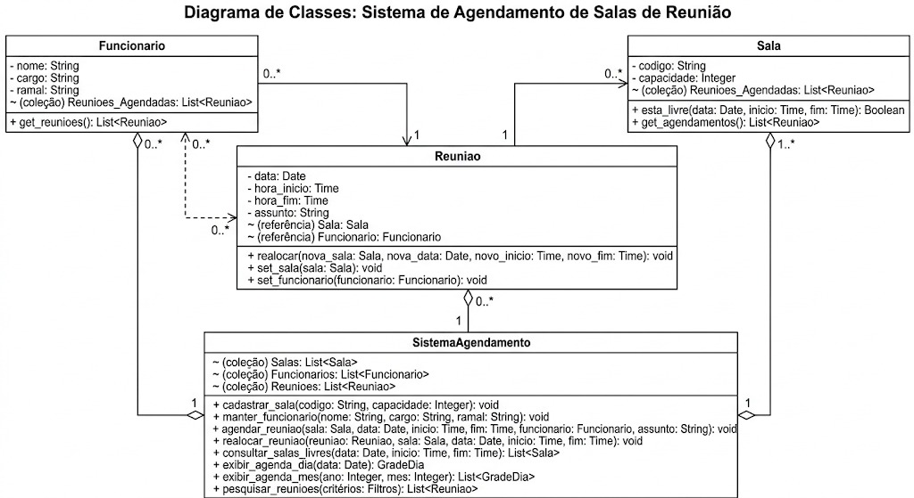
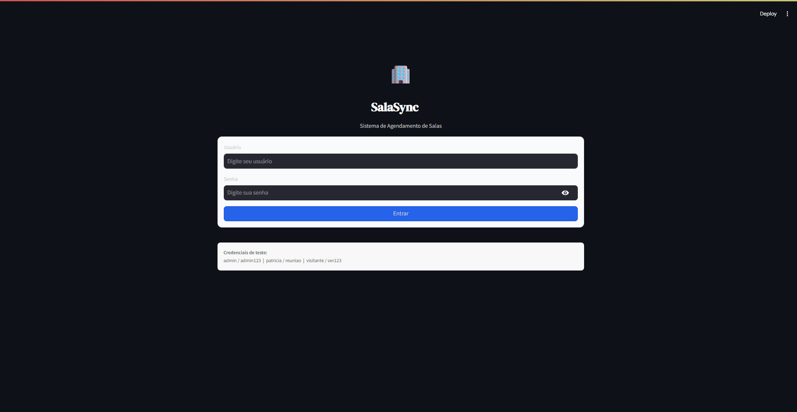
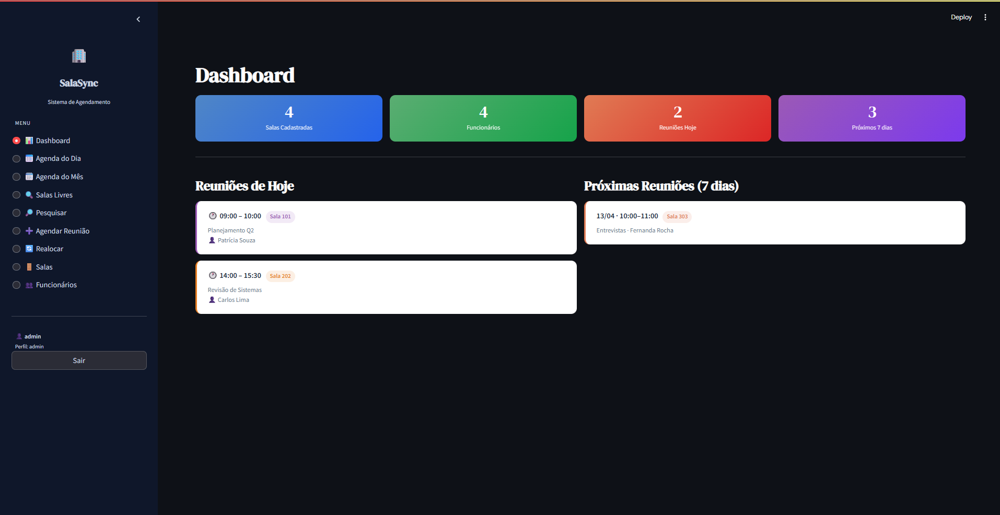

# 🏢 SALASYNC – Sistema de Agendamento de Salas de Reunião

> Projeto de Engenharia de Software · Python + Streamlit

---

## 📐 1. Diagrama de Classes

O diagrama abaixo foi elaborado em UML e descreve a estrutura do sistema com as classes **Sala**, **Funcionario**, **Reuniao** e **SistemaAgendamento**, com relações de composição e associação entre elas.



| Elemento | Tipo | Descrição |
|---|---|---|
| `Sala` | Classe | RF01 / RF08 / RF09 – Sala de reunião com código e capacidade |
| `Funcionario` | Classe | RF02 – Funcionário responsável por reuniões, com nome, cargo e ramal |
| `Reuniao` | Classe | RF03 / RF06 – Reunião com data, horários, sala, responsável e assunto |
| `SistemaAgendamento` | Classe | RF04–RF10 – Classe central que agrega e opera sobre salas, funcionários e reuniões |
| `codigo` | String (privado) | RF01 – Identificador da sala (ex.: 101, Auditório) |
| `capacidade` | int (privado) | RF01 / RF09 – Número de lugares da sala |
| `nome` | String (privado) | RF02 – Nome completo do funcionário |
| `cargo` | String (privado) | RF02 – Cargo do funcionário |
| `ramal` | String (privado) | RF02 – Ramal telefônico do funcionário |
| `id` | String (privado) | RF03 – Identificador único da reunião gerado automaticamente |
| `data` | String (privado) | RF03 – Data da reunião no formato ISO (YYYY-MM-DD) |
| `hora_inicio` | String (privado) | RF03 / RF07 – Horário de início da reunião (HH:MM) |
| `hora_fim` | String (privado) | RF03 / RF07 – Horário de fim da reunião (HH:MM) |
| `sala` | String (privado) | RF03 – Código da sala vinculada à reunião |
| `funcionario` | String (privado) | RF03 – Nome do funcionário responsável |
| `assunto` | String (privado) | RF03 – Descrição do assunto da reunião |
| `esta_livre()` | Método público | RF07 / RF08 – Verifica disponibilidade da sala em data e faixa de horário |
| `get_agendamentos()` | Método público | RF04 – Retorna todas as reuniões de uma sala |
| `get_reunioes()` | Método público | RF10 – Retorna todas as reuniões de um funcionário |
| `realocar()` | Método público | RF06 – Altera sala, data e/ou horários de uma reunião |
| `cadastrar_sala()` | Método público | RF01 – Valida duplicidade e adiciona nova sala |
| `remover_sala()` | Método público | RF01 – Remove sala sem reuniões agendadas |
| `manter_funcionario()` | Método público | RF02 – Cadastra ou edita funcionário, atualizando referências em reuniões |
| `agendar_reuniao()` | Método público | RF03 / RF07 – Agenda reunião após verificar conflito de horário |
| `realocar_reuniao()` | Método público | RF06 / RF07 – Realoca reunião validando disponibilidade na nova data/horário |
| `excluir_reuniao()` | Método público | RF10 – Remove reunião do sistema |
| `consultar_salas_livres()` | Método público | RF08 / RF09 – Retorna salas disponíveis com capacidade na faixa informada |
| `exibir_agenda_dia()` | Método público | RF04 – Gera grade de horários por sala para um dia específico |
| `exibir_agenda_mes()` | Método público | RF05 – Gera mapa de reuniões agrupadas por dia no mês selecionado |
| `pesquisar_reunioes()` | Método público | RF10 – Filtra reuniões por data, sala e/ou funcionário |

---

## ✅ 2. Requisitos Funcionais (RF)

| ID | Descrição |
|---|---|
| RF01 | Cadastrar salas de reunião com código/identificação e capacidade de lugares. |
| RF02 | Manter cadastro de funcionários com nome, cargo e ramal (cadastrar, editar e remover). |
| RF03 | Agendar reunião informando sala, data, horário de início, horário de fim, funcionário responsável e assunto. |
| RF04 | Exibir agenda do dia em grade de horários × salas, mostrando responsável e assunto em cada célula. |
| RF05 | Exibir agenda do mês em calendário visual com navegação por dia para detalhamento. |
| RF06 | Realocar reunião existente permitindo alterar sala, data e/ou horário. |
| RF07 | Impedir conflito de agendamento — proibir sobreposição de reuniões na mesma sala e horário. |
| RF08 | Consultar salas livres em uma data e faixa de horário informadas (início e fim). |
| RF09 | Na consulta de salas livres, exibir a capacidade (número de lugares) de cada sala disponível. |
| RF10 | Pesquisar e listar reuniões por critérios combinados: data, sala e/ou funcionário, com opção de exclusão. |

---

## 🔒 3. Requisitos Não Funcionais (RNF)

| ID | Descrição |
|---|---|
| RNF01 | **Usabilidade** — interface em formato de planilha/agenda para visualização rápida por dia, com slots de 30 minutos das 07h às 21h. |
| RNF02 | **Desempenho** — consultas de disponibilidade retornam rapidamente mesmo com muitos agendamentos, via pesquisa linear em memória. |
| RNF03 | **Controle de acesso** — ações de alteração (agendar, realocar, excluir, gerenciar salas e funcionários) são restritas ao perfil `admin`; perfil `viewer` tem acesso somente de leitura. |
| RNF04 | **Organização** — agendamentos mantidos e consultados por mês e por dia, espelhando a estrutura de pastas e planilhas utilizada pela gestora. |
| RNF05 | **Disponibilidade** — consulta de agenda e salas livres acessível sem interrupções, com dados persistidos em arquivo JSON local. |

---

## 🧠 4. Engenharia de Prompt

### Prompt utilizado

```
Construa uma aplicação funcional em Python utilizando Streamlit, em um único arquivo executável, com base nos requisitos funcionais, não funcionais e no diagrama de classes fornecidos em anexo.
A aplicação deve obrigatoriamente:

1 - Implementar todas as entidades, atributos e relacionamentos definidos no diagrama de classes, respeitando composição, agregação e herança quando aplicável

2 - Traduzir os requisitos funcionais em funcionalidades reais na interface (CRUD completo, autenticação, filtros, etc., conforme especificado)

3 - Atender aos requisitos não funcionais, incluindo:

• organização de código
• separação lógica (mesmo em arquivo único)
• legibilidade e manutenção

4 - Utilizar Streamlit para construir uma interface interativa com:

• navegação entre páginas ou seções
• formulários funcionais
• exibição de dados dinâmica

5 - Implementar persistência de dados (em JSON)

6 - Incluir dados iniciais mockados para permitir teste imediato

7 - Estar pronto para execução com o comando: streamlit run app.py

8 - Restrições obrigatórias:

• Código deve estar em um único arquivo
• Não utilizar dependências externas além de Streamlit e bibliotecas padrão do Python
• Não deixar funcionalidades incompletas ou simuladas
• Não explicar conceitos, apenas implementar

9 - Critérios de aceitação:

• A aplicação roda sem erro ao executar
• Todas as funcionalidades principais estão operacionais
• Interface permite fluxo completo de uso sem intervenção manual no código

10 - Saída esperada:

• Código completo do arquivo app.py
```

### Análise das técnicas aplicadas

| Técnica | Como foi aplicada |
|---|---|
| **Contexto rico** | Diagrama UML + RFs + NRFs fornecidos como contexto estruturado junto ao prompt |
| **Restrição de stack** | `"Python e Streamlit em um único arquivo"` – delimita tecnologias e formato de entrega |
| **Orientação ao resultado** | `"funcionar agora mesmo"` – evita saídas parciais ou apenas explicativas |
| **Completude implícita** | `"funcionalidades necessárias"` – o modelo infere o que não foi listado explicitamente |
| **Multimodal** | Imagem do diagrama de classes enviada junto ao prompt textual |

---

## 🖥️ 5. Projeto em Execução

Capturas da aplicação rodando: tela de **login** com perfis de acesso diferenciados e **dashboard** principal exibindo KPIs de salas, funcionários e reuniões do dia — tema escuro com sidebar azul-marinho e cards coloridos por sala.

| Tela de Login | Dashboard Principal |
|---|---|
|  |  |

---

## 🚀 6. Como Fazer o Projeto Rodar

### Pré-requisito

- **Python 3.8+** → Baixe em [https://www.python.org/downloads/](https://www.python.org/downloads/)

---

### Passo 1 – Salve os arquivos

Salve `app.py` e `agendamento_data.json` na mesma pasta:

```
# Windows
C:\Projetos\salasync\app.py
C:\Projetos\salasync\agendamento_data.json

# Mac / Linux
~/projetos/salasync/app.py
~/projetos/salasync/agendamento_data.json
```

---

### Passo 2 – Instale o Streamlit

Abra o terminal (Prompt de Comando no Windows / Terminal no Mac-Linux) e execute:

```bash
pip install streamlit
```

---

### Passo 3 – Execute a aplicação

No terminal, navegue até a pasta do arquivo e execute:

```bash
# Windows
cd C:\Projetos\salasync

# Mac / Linux
cd ~/projetos/salasync

# Rodar
streamlit run app.py
```

---

### Passo 4 – Acesse no navegador

O Streamlit abrirá o navegador automaticamente. Se não abrir, acesse manualmente:

```
http://localhost:8501
```

---

### Passo 5 – Credenciais de acesso

| Usuário | Senha | Perfil | Acesso |
|---|---|---|---|
| `admin` | `admin123` | Administrador | Todas as funcionalidades |
| `patricia` | `reuniao` | Administrador | Todas as funcionalidades |
| `visitante` | `ver123` | Visualizador | Somente leitura (RNF03) |

---

### Passo 6 – Use a aplicação

| Clique | O que fazer |
|---|---|
| **📊 Dashboard** | Visualize KPIs e reuniões do dia e dos próximos 7 dias |
| **📅 Agenda do Dia** | Selecione uma data e veja a grade horária completa por sala |
| **🗓️ Agenda do Mês** | Navegue pelo calendário mensal e clique em um dia para detalhar |
| **🔍 Salas Livres** | Informe data e faixa de horário para consultar salas disponíveis e suas capacidades |
| **🔎 Pesquisar** | Filtre reuniões por data, sala e/ou funcionário; exclua 🗑️ se for admin |
| **➕ Agendar** *(admin)* | Preencha sala, data, horário, responsável e assunto para criar uma reunião |
| **🔄 Realocar** *(admin)* | Selecione uma reunião e altere sala, data e/ou horários |
| **🚪 Salas** *(admin)* | Cadastre novas salas ou remova as que não possuem reuniões |
| **👥 Funcionários** *(admin)* | Cadastre, edite ou remova funcionários do sistema |

---

*Projeto gerado com Engenharia de Prompt · Python 3 · Streamlit · 2026*