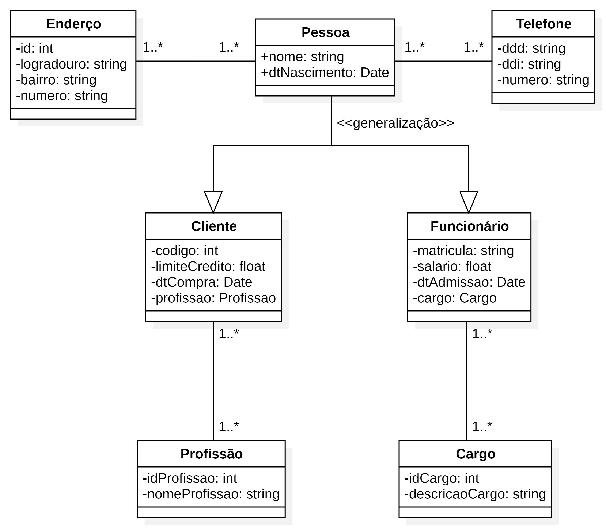
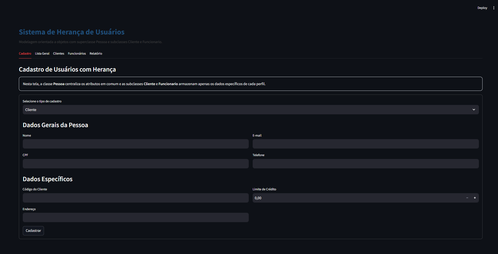

# 📘 Questão 11 — Sistema de Herança de Usuários (POO)

---

## 🧠 1. Visão Geral

Este projeto apresenta a modelagem e implementação de um sistema utilizando **Diagrama de Classes UML**, com foco na aplicação de conceitos da **Programação Orientada a Objetos (POO)**.

O sistema representa entidades do mundo real como:

- Pessoa
- Cliente
- Funcionário

A modelagem foi construída com base nos princípios de:

- Herança
- Generalização e Especialização
- Alta coesão
- Baixo acoplamento
- Polimorfismo

---

## 🎯 2. Objetivo

Demonstrar, de forma prática, a aplicação dos conceitos fundamentais de POO:

- Reaproveitamento de código via herança
- Redução de redundância de atributos
- Organização clara de responsabilidades entre classes
- Validação de regras de negócio no domínio
- Uso correto de generalização e especialização

---

## 🏗️ 3. Estrutura do Sistema

A estrutura central do sistema é baseada na classe **Pessoa**, que atua como superclasse.

**Hierarquia:**
```
Pessoa
├── Cliente
└── Funcionario
```

Cada subclasse herda os atributos comuns de `Pessoa` e adiciona apenas os dados específicos do seu perfil:

- `Cliente` → código, endereço e limite de crédito
- `Funcionario` → matrícula, cargo e salário

---

## 📦 4. Classes do Sistema

### 👤 Pessoa (Superclasse)

Classe base que centraliza os atributos comuns a todos os perfis de usuário.

**Atributos:**
- `nome`: String
- `cpf`: String
- `email`: String
- `telefone`: String

**Métodos:**
- `tipo()` → retorna o tipo da instância
- `dados_gerais()` → retorna os atributos herdados em dicionário
- `resumo()` → retorna string resumida com tipo, nome e CPF

---

### 🛒 Cliente (Subclasse de Pessoa)

Representa os clientes do sistema.

**Atributos específicos:**
- `codigo_cliente`: String
- `endereco`: String
- `limite_credito`: float

**Métodos:**
- `tipo()` → retorna `"Cliente"`
- `dados_especificos()` → retorna os dados exclusivos do cliente
- `dados_completos()` → une dados gerais e específicos

---

### 👨‍💼 Funcionario (Subclasse de Pessoa)

Representa os funcionários da organização.

**Atributos específicos:**
- `matricula`: String
- `cargo`: String
- `salario`: float

**Métodos:**
- `tipo()` → retorna `"Funcionário"`
- `dados_especificos()` → retorna os dados exclusivos do funcionário
- `dados_completos()` → une dados gerais e específicos

---

## ✅ 5. Requisitos Funcionais (RF)

| ID | Descrição |
|---|---|
| RF01 | Manter cadastro de Pessoas com nome e data de nascimento. |
| RF02 | Manter cadastro de Telefones (DDD, DDI, número) associados a uma Pessoa, permitindo que uma Pessoa possua um ou vários telefones. |
| RF03 | Manter cadastro de Endereços (logradouro, bairro, número) associados a Pessoas, permitindo que uma Pessoa possua um ou vários endereços e que um Endereço possa ser compartilhado por várias Pessoas. |
| RF04 | Manter cadastro de Clientes (especialização de Pessoa) com código, limite de crédito e data de compra. |
| RF05 | Manter cadastro de Funcionários (especialização de Pessoa) com matrícula, salário e data de admissão. |
| RF06 | Manter cadastro de Profissões e associar Profissão a Cliente, permitindo que um Cliente possua uma ou mais profissões e que uma Profissão esteja associada a vários Clientes. |
| RF07 | Manter cadastro de Cargos e associar Cargo a Funcionário, permitindo que um Funcionário possua um cargo e que um Cargo esteja associado a um ou vários Funcionários. |

---

## 🔒 6. Requisitos Não Funcionais (RNF)

| ID | Descrição |
|---|---|
| RNF01 | **Herança** — `Cliente` e `Funcionario` herdam os atributos e métodos de `Pessoa`, eliminando redundância de código. |
| RNF02 | **Unicidade de CPF** — o sistema impede o cadastro de duas pessoas com o mesmo CPF. |
| RNF03 | **Validação de campos** — todos os campos obrigatórios são verificados antes do cadastro; valores monetários devem ser ≥ 0. |
| RNF04 | **Alta coesão** — cada classe possui responsabilidade única; `Pessoa` centraliza dados comuns, as subclasses gerenciam apenas seus dados específicos. |
| RNF05 | **Baixo acoplamento** — as subclasses são independentes entre si e extensíveis sem alterar a superclasse. |

---

## 🔗 7. Relacionamentos

**Pessoa → Cliente**
- `Pessoa` é generalizada em `Cliente`
- `Cliente` herda todos os atributos e métodos de `Pessoa`

**Pessoa → Funcionario**
- `Pessoa` é generalizada em `Funcionario`
- `Funcionario` herda todos os atributos e métodos de `Pessoa`

**lista_geral → Pessoa**
- A lista centraliza instâncias de `Cliente` e `Funcionario` polimorficamente
- Permite filtrar por tipo sem alterar a estrutura de dados

---

## 📊 8. Cardinalidade

| Relacionamento | Cardinalidade |
|---|---|
| Pessoa ↔ Telefone | 1 → 1..* |
| Pessoa ↔ Endereco | 1..* ↔ 1..* |
| Funcionario ↔ Cargo | 1 → 1 / 1 → N |
| Cliente ↔ Profissao | 1 → 1 / 1 → N |
| lista_geral ↔ Pessoa | 1 → 0..* |
| CPF ↔ Pessoa | 1 → 1 (único) |

---

## 🧩 9. Conceitos de POO Aplicados

✔️ **Herança**
`Cliente` e `Funcionario` herdam de `Pessoa`, reaproveitando nome, CPF, e-mail e telefone.

✔️ **Generalização**
`Pessoa` representa o conceito geral de qualquer usuário do sistema.

✔️ **Especialização**
`Cliente` e `Funcionario` possuem atributos e comportamentos específicos ao seu perfil.

✔️ **Polimorfismo**
O método `tipo()` é sobrescrito em cada subclasse, retornando o nome correto do perfil.

✔️ **Alta Coesão**
Cada classe tem uma responsabilidade clara e bem definida.

✔️ **Baixo Acoplamento**
As subclasses são independentes entre si e não dependem umas das outras.

---

## ⚙️ 10. Regras de Negócio

- Toda pessoa deve possuir nome, CPF, e-mail e telefone
- O CPF é único no sistema — não é permitido duplicidade
- Cliente e Funcionário são tipos de Pessoa
- O limite de crédito do cliente não pode ser negativo
- O salário do funcionário não pode ser negativo
- Código do cliente, endereço, matrícula e cargo são obrigatórios
- O relatório unificado exibe dados completos de todas as instâncias

---

## 🧠 11. Engenharia de Prompt

### Prompt utilizado

```
Reestruture o modelo utilizando HERANÇA.
Crie uma superclasse que represente os atributos comuns entre:
Cliente
Funcionário
Considere:
nome
data de nascimento
endereço
telefones
E mantenha atributos específicos:
Funcionário → salário, cargo, matrícula
Cliente → profissão, código

Estrutura:
1. Entendimento do problema
2. Requisitos Funcionais (mínimo 6)
3. Requisitos Não Funcionais
4. Identificação da Superclasse (ex: Pessoa)
5. Subclasses: Cliente e Funcionário
6. Atributos (divididos corretamente)
7. Métodos (incluindo herdados)
8. Relacionamentos
9. PlantUML (com herança)
10. Streamlit: cadastro de cliente, cadastro de funcionário,
    exibição de dados herdados, promoção de funcionário,
    reajuste salarial e cálculo de idade
```

### Análise das técnicas aplicadas

| Técnica | Como foi aplicada |
|---|---|
| **Estrutura numerada** | O prompt lista explicitamente os 10 tópicos esperados na resposta, guiando o modelo passo a passo |
| **Restrição de domínio** | Atributos comuns e específicos listados diretamente, evitando ambiguidade na divisão de responsabilidades |
| **Orientação ao resultado** | Funcionalidades Streamlit descritas concretamente (promoção, reajuste, cálculo de idade) |
| **Completude implícita** | `"mínimo 6 requisitos"` instrui o modelo a não truncar a análise |
| **Multimodal** | Imagem do diagrama de classes enviada junto ao prompt textual |

---

## 📐 12. Diagrama de Classes



---

## 💻 13. Exemplo de Implementação

```python
class Pessoa:
    def __init__(self, nome: str, cpf: str, email: str, telefone: str):
        self.nome = nome.strip()
        self.cpf = cpf.strip()
        self.email = email.strip()
        self.telefone = telefone.strip()

    def tipo(self) -> str:
        return "Pessoa"

    def dados_gerais(self) -> dict:
        return {
            "Tipo": self.tipo(),
            "Nome": self.nome,
            "CPF": self.cpf,
            "E-mail": self.email,
            "Telefone": self.telefone,
        }


class Cliente(Pessoa):
    def __init__(self, nome, cpf, email, telefone,
                 codigo_cliente, endereco, limite_credito):
        super().__init__(nome, cpf, email, telefone)
        self.codigo_cliente = codigo_cliente.strip()
        self.endereco = endereco.strip()
        self.limite_credito = float(limite_credito)

    def tipo(self) -> str:
        return "Cliente"


class Funcionario(Pessoa):
    def __init__(self, nome, cpf, email, telefone,
                 matricula, cargo, salario):
        super().__init__(nome, cpf, email, telefone)
        self.matricula = matricula.strip()
        self.cargo = cargo.strip()
        self.salario = float(salario)

    def tipo(self) -> str:
        return "Funcionário"
```

---

## 🖥️ 14. Projeto em Execução

Captura da aplicação rodando: aba **Cadastro** com formulário dinâmico que exibe campos específicos de Cliente ou Funcionário conforme o tipo selecionado — interface com abas para lista geral, subpainéis e relatório unificado em JSON.



---

## 🚀 15. Como Fazer o Projeto Rodar

### Pré-requisito

- **Python 3.8+** → Baixe em [https://www.python.org/downloads/](https://www.python.org/downloads/)

### Passo 1 – Salve o arquivo

```
# Windows
C:\Projetos\herancausuarios\app.py

# Mac / Linux
~/projetos/herancausuarios/app.py
```

### Passo 2 – Instale o Streamlit

```bash
pip install streamlit
```

### Passo 3 – Execute a aplicação

```bash
streamlit run app.py
```

### Passo 4 – Acesse no navegador

```
http://localhost:8501
```

### Passo 5 – Use a aplicação

| Aba | O que fazer |
|---|---|
| **Cadastro** | Selecione o tipo (Cliente ou Funcionário), preencha os dados gerais e específicos e clique em **Cadastrar** |
| **Lista Geral** | Visualize todos os registros com filtro por tipo e métricas de total, clientes e funcionários |
| **Clientes** | Pesquise clientes por nome e visualize seus dados completos em cards |
| **Funcionários** | Pesquise funcionários por nome e visualize seus dados completos em cards |
| **Relatório** | Veja o relatório unificado com os dados completos de cada instância em formato JSON |

---

## 🚀 16. Vantagens da Modelagem

- Reutilização de código via herança da superclasse `Pessoa`
- Facilidade de manutenção — alterações em `Pessoa` refletem em todas as subclasses
- Organização clara com responsabilidades bem separadas
- Escalabilidade — novas especializações (ex.: `Fornecedor`) podem ser adicionadas sem alterar o código existente
- Validação centralizada de campos comuns a todos os perfis

---

## 🧾 17. Conclusão

A modelagem apresentada demonstra uma aplicação correta dos conceitos de POO, especialmente:

- **Herança** — eliminação de redundância entre `Cliente` e `Funcionario`
- **Polimorfismo** — método `tipo()` com comportamento específico em cada subclasse
- **Separação de responsabilidades** — dados gerais em `Pessoa`, dados específicos nas subclasses

A classe `Pessoa` centraliza os dados comuns, enquanto `Cliente` e `Funcionario` especializam o comportamento do sistema.

Essa estrutura torna o sistema mais:

- limpo
- organizado
- fácil de evoluir

---

## 📌 18. Resumo Final

- `Pessoa` é a classe base do sistema
- `Cliente` e `Funcionario` herdam de `Pessoa`
- O CPF é o identificador único de cada instância
- A lista geral armazena polimorficamente qualquer tipo de `Pessoa`
- Cada subclasse implementa `tipo()`, `dados_especificos()` e `dados_completos()`
- O sistema possui 5 abas: Cadastro, Lista Geral, Clientes, Funcionários e Relatório
- O sistema segue boas práticas de POO