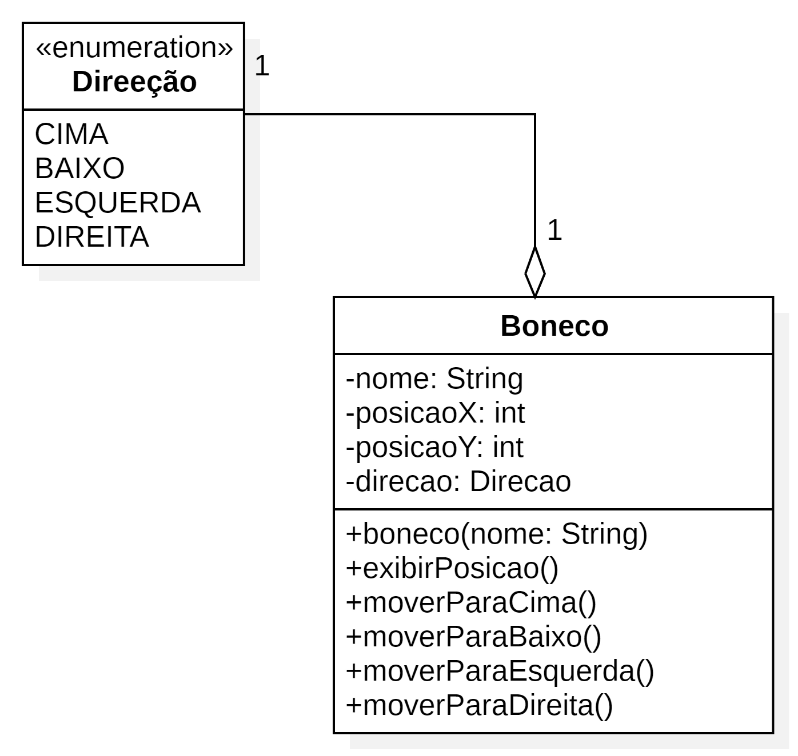
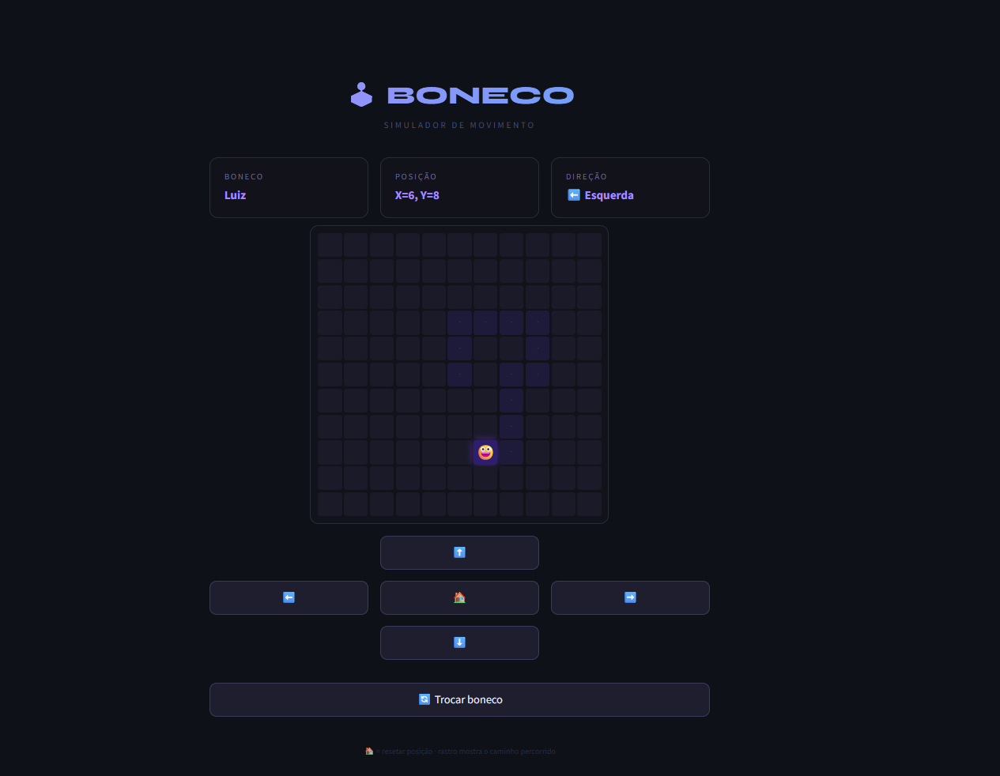

# 🕹️ BONECO – Simulador de Movimento

> Projeto de Engenharia de Software · Python + Streamlit

---

## 📐 1. Diagrama de Classes

O diagrama abaixo foi elaborado em UML e descreve a estrutura do sistema com a enumeração **Direção** e a classe **Boneco**, que a compõe por agregação (1-para-1).



| Elemento | Tipo | Descrição |
|---|---|---|
| `«enum» Direção` | Enumeração | CIMA · BAIXO · ESQUERDA · DIREITA |
| `nome` | String (privado) | RF01 – Nome cadastrado |
| `posicaoX` | int (privado) | RF02 / RF06 / RF07 – Eixo X |
| `posicaoY` | int (privado) | RF02 / RF04 / RF05 – Eixo Y |
| `direcao` | Direcao (privado) | RF03 – Direção atual |
| `moverParaCima()` | Método público | RF04 – Y decrementa |
| `moverParaBaixo()` | Método público | RF05 – Y incrementa |
| `moverParaEsquerda()` | Método público | RF06 – X decrementa |
| `moverParaDireita()` | Método público | RF07 – X incrementa |

---

## ✅ 2. Requisitos Funcionais (RF)

| ID | Descrição |
|---|---|
| RF01 | Cadastrar o nome do boneco. |
| RF02 | Exibir a posição atual do boneco (X, Y). |
| RF03 | Exibir a direção atual do boneco (Cima, Baixo, Direita, Esquerda). |
| RF04 | Permitir mover o boneco para cima – eixo Y. |
| RF05 | Permitir mover o boneco para baixo – eixo Y. |
| RF06 | Permitir mover o boneco para esquerda – eixo X. |
| RF07 | Permitir mover o boneco para direita – eixo X. |
| RF08 | Ao mover o boneco, atualizar automaticamente a posição. |

---

## 🔒 3. Requisitos Não Funcionais (NRF)

| ID | Descrição |
|---|---|
| NRF01 | Tempo de resposta máximo de 0,5 s por interação. |
| NRF02 | Consistência dos dados – posição e direção sempre sincronizados. |
| NRF03 | Direção restrita aos 4 valores: Cima, Baixo, Esquerda, Direita. |
| NRF04 | Interface limpa e simples, fluxo completo em apenas 2 cliques. |
| NRF05 | O boneco deve aparecer se movendo visivelmente na tela. |

---

## 🧠 4. Engenharia de Prompt

### Prompt utilizado

```
Baseado nos requisitos funcionais e não funcionais e no diagrama de classes em anexo,
construa uma aplicação com Python e Streamlit em um único arquivo com funcionalidades
necessárias e aplicações para funcionar agora mesmo.
```

### Análise das técnicas aplicadas

| Técnica | Como foi aplicada |
|---|---|
| **Contexto rico** | Diagrama UML + RFs + NRFs fornecidos como contexto estruturado junto ao prompt |
| **Restrição de stack** | `"Python e Streamlit em um único arquivo"` – delimita tecnologias e formato de entrega |
| **Orientação ao resultado** | `"funcionar agora mesmo"` – evita saídas parciais ou apenas explicativas |
| **Completude implícita** | `"funcionalidades necessárias"` – o modelo infere o que não foi listado explicitamente |
| **Multimodal** | Imagem do diagrama de classes enviada junto ao prompt textual |

---

## 🖥️ 5. Projeto em Execução

Captura da aplicação rodando: boneco **"Luiz"** posicionado em **X=6, Y=8**, direção **Esquerda**, com rastro do caminho percorrido visível no grid 11×11.



---

## 🚀 6. Como Fazer o Projeto Rodar

### Pré-requisito

- **Python 3.8+** → Baixe em [https://www.python.org/downloads/](https://www.python.org/downloads/)

---

### Passo 1 – Salve o arquivo

Salve o arquivo `boneco_app.py` em uma pasta de sua preferência:

```
# Windows
C:\Projetos\boneco\boneco_app.py

# Mac / Linux
~/projetos/boneco/boneco_app.py
```

---

### Passo 2 – Instale o Streamlit

Abra o terminal (Prompt de Comando no Windows / Terminal no Mac-Linux) e execute:

```bash
pip install streamlit
```

---

### Passo 3 – Execute a aplicação

No terminal, navegue até a pasta do arquivo e execute:

```bash
# Windows
cd C:\Projetos\boneco

# Mac / Linux
cd ~/projetos/boneco

# Rodar
streamlit run boneco_app.py
```

---

### Passo 4 – Acesse no navegador

O Streamlit abrirá o navegador automaticamente. Se não abrir, acesse manualmente:

```
http://localhost:8501
```

---

### Passo 5 – Use a aplicação

| Clique | O que fazer |
|---|---|
| **1º clique** | Digite o nome do boneco no campo e clique em **▶ Iniciar** |
| **2º clique** | Use o D-pad ⬆️ ⬅️ ⬇️ ➡️ para mover o boneco pelo grid |
| 🏠 *(extra)* | Reseta o boneco para o centro do grid (posição 5,5) |
| 🔄 *(extra)* | Clique em **Trocar boneco** para cadastrar um novo nome |

---

*Projeto gerado com Engenharia de Prompt · Python 3 · Streamlit · 2026*