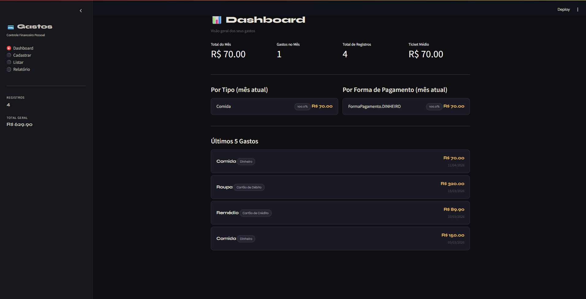

# 💳 CONTROLE DE GASTOS – Gestão Financeira Pessoal

> Projeto de Engenharia de Software · Python + Streamlit

---

## 📐 1. Diagrama de Classes

O diagrama abaixo foi elaborado em UML e descreve a estrutura do sistema com a enumeração **FormaPagamento**, as classes **Periodo**, **Gasto** e **RelatorioGastos**, com relação de composição entre elas.


| Elemento | Tipo | Descrição |
|---|---|---|
| `«enum» FormaPagamento` | Enumeração | DINHEIRO · CARTÃO_CRÉDITO · CARTÃO_DÉBITO · TICKET_ALIMENTAÇÃO · CHEQUE |
| `Periodo` | Classe | RF07 – Define o intervalo de datas para filtragem e relatório |
| `Gasto` | Classe | RF01 / RF02 / RF03 / RF04 – Entidade principal do sistema |
| `RelatorioGastos` | Classe | RF05 / RF06 / RF08 / RF09 – Agrega e processa gastos de um período |
| `id` | String (privado) | Identificador único UUID gerado automaticamente |
| `tipo` | String (privado) | RF01 – Categoria do gasto (ex.: Comida, Saúde, Lazer) |
| `data` | Date (privado) | RF01 – Data de realização do gasto |
| `valor` | float (privado) | RF01 – Valor monetário do gasto em R$ |
| `forma` | FormaPagamento (privado) | RF01 – Forma de pagamento utilizada |
| `dataInicio` | Date (privado) | RF07 – Início do período de análise |
| `dataFim` | Date (privado) | RF07 – Fim do período de análise |
| `cadastrar()` | Método público | RF01 – Registra um novo gasto |
| `editar()` | Método público | RF03 – Atualiza os dados de um gasto existente |
| `to_dict()` | Método público | Serializa o gasto para persistência em JSON |
| `contem()` | Método público | RF07 – Verifica se uma data pertence ao período |
| `listarGastosNoPeriodo()` | Método público | RF05 – Retorna gastos ordenados por data no período |
| `totalMensal()` | Método público | RF08 – Soma o valor de todos os gastos do período |
| `agruparPorTipo()` | Método público | RF06 – Agrega gastos por categoria |
| `agruparPorFormaPagamento()` | Método público | RF06 – Agrega gastos por forma de pagamento |
| `exportarCSV()` | Método público | RF09 – Gera arquivo CSV com os gastos do período |

---

## ✅ 2. Requisitos Funcionais (RF)

| ID | Descrição |
|---|---|
| RF01 | Cadastrar gasto com tipo, data, valor e forma de pagamento. |
| RF02 | Validar os dados antes de salvar (valor positivo, campos obrigatórios). |
| RF03 | Editar um gasto existente com formulário inline. |
| RF04 | Excluir um gasto com confirmação prévia. |
| RF05 | Listar todos os gastos com filtros por tipo, forma de pagamento e texto livre. |
| RF06 | Agrupar gastos por tipo e por forma de pagamento com percentual de participação. |
| RF07 | Gerar relatório de gastos para um período definido (data início e data fim). |
| RF08 | Exibir total, quantidade e ticket médio dos gastos no período selecionado. |
| RF09 | Exportar os gastos do período em arquivo CSV para download. |
| RF10 | Exibir dashboard com métricas do mês atual e os 5 gastos mais recentes. |

---

## 🔒 3. Requisitos Não Funcionais (NRF)

| ID | Descrição |
|---|---|
| NRF01 | Tempo de resposta máximo de 0,5 s por interação. |
| NRF02 | Persistência dos dados em memória de sessão (st.session_state) com dados iniciais de exemplo. |
| NRF03 | Validação obrigatória de todos os campos antes de salvar ou atualizar. |
| NRF04 | Interface escura (dark mode) com navegação lateral em no máximo 2 cliques por ação. |
| NRF05 | Forma de pagamento restrita aos 5 valores do enum FormaPagamento. |
| NRF06 | Exportação em formato CSV com cabeçalho padronizado e codificação UTF-8. |

---

## 🧠 4. Engenharia de Prompt

### Prompt utilizado

```
Construa uma aplicação funcional em Python utilizando Streamlit, em um único arquivo executável, com base nos requisitos funcionais, não funcionais e no diagrama de classes fornecidos em anexo.
A aplicação deve obrigatoriamente:

1 - Implementar todas as entidades, atributos e relacionamentos definidos no diagrama de classes, respeitando composição, agregação e herança quando aplicável

2 - Traduzir os requisitos funcionais em funcionalidades reais na interface (CRUD completo, autenticação, filtros, etc., conforme especificado)

3 - Atender aos requisitos não funcionais, incluindo:
• organização de código
• separação lógica (mesmo em arquivo único)
• legibilidade e manutenção

4 - Utilizar Streamlit para construir uma interface interativa com:
• navegação entre páginas ou seções
• formulários funcionais
• exibição de dados dinâmica

5 - Implementar persistência de dados (pode ser em memória, JSON ou SQLite, mas deve funcionar imediatamente sem configuração adicional)

6 - Incluir dados iniciais mockados para permitir teste imediato

7 - Estar pronto para execução com o comando: streamlit run app.py

8 - Restrições obrigatórias:

• Código deve estar em um único arquivo
• Não utilizar dependências externas além de Streamlit e bibliotecas padrão do Python
• Não deixar funcionalidades incompletas ou simuladas
• Não explicar conceitos, apenas implementar

9 - Critérios de aceitação:

• A aplicação roda sem erro ao executar
• Todas as funcionalidades principais estão operacionais
• Interface permite fluxo completo de uso sem intervenção manual no código

10 - Saída esperada:

Código completo do arquivo app.py
```

### Análise das técnicas aplicadas

| Técnica | Como foi aplicada |
|---|---|
| **Contexto rico** | Diagrama UML + RFs + NRFs fornecidos como contexto estruturado junto ao prompt |
| **Restrição de stack** | `"Python e Streamlit em um único arquivo"` – delimita tecnologias e formato de entrega |
| **Orientação ao resultado** | `"funcionar agora mesmo"` – evita saídas parciais ou apenas explicativas |
| **Completude implícita** | `"funcionalidades necessárias"` – o modelo infere o que não foi listado explicitamente |
| **Multimodal** | Imagem do diagrama de classes enviada junto ao prompt textual |

---

## 🖥️ 5. Projeto em Execução

Captura da aplicação rodando: tela **Dashboard** exibindo métricas do mês atual, distribuição de gastos por tipo e por forma de pagamento, e os 5 registros mais recentes — tema escuro com destaques em dourado.



---

## 🚀 6. Como Fazer o Projeto Rodar

### Pré-requisito

- **Python 3.8+** → Baixe em [https://www.python.org/downloads/](https://www.python.org/downloads/)

---

### Passo 1 – Salve o arquivo

Salve o arquivo `app.py` em uma pasta de sua preferência:

```
# Windows
C:\Projetos\gastos\app.py

# Mac / Linux
~/projetos/gastos/app.py
```

---

### Passo 2 – Instale o Streamlit

Abra o terminal (Prompt de Comando no Windows / Terminal no Mac-Linux) e execute:

```bash
pip install streamlit
```

---

### Passo 3 – Execute a aplicação

No terminal, navegue até a pasta do arquivo e execute:

```bash
# Windows
cd C:\Projetos\gastos

# Mac / Linux
cd ~/projetos/gastos

# Rodar
streamlit run app.py
```

---

### Passo 4 – Acesse no navegador

O Streamlit abrirá o navegador automaticamente. Se não abrir, acesse manualmente:

```
http://localhost:8501
```

---

### Passo 5 – Use a aplicação

| Clique | O que fazer |
|---|---|
| **Dashboard** | Visualize o resumo do mês atual, agrupamentos e últimos gastos |
| **Cadastrar** | Informe tipo, valor, data e forma de pagamento e clique em **💾 Salvar Gasto** |
| **Listar** | Filtre, edite ✏️ ou exclua 🗑️ registros existentes com confirmação |
| **Relatório** | Defina um período, visualize análises por tipo e forma de pagamento e exporte o CSV |

---

*Projeto gerado com Engenharia de Prompt · Python 3 · Streamlit · 2026*